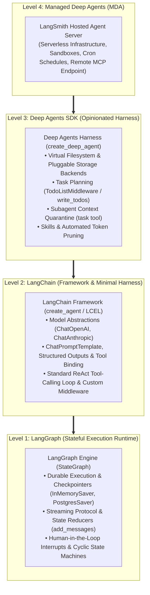
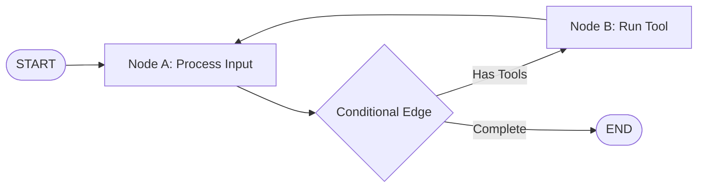
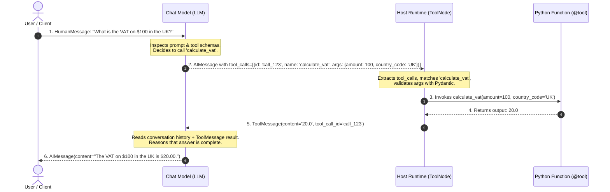
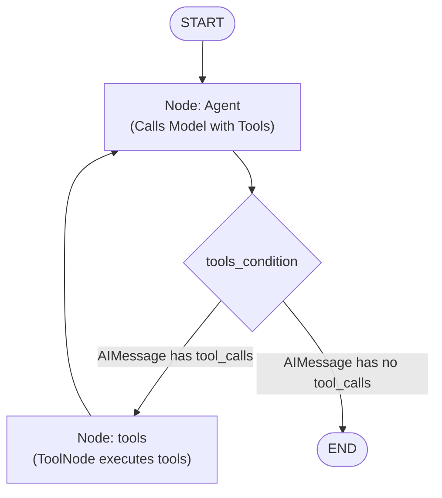
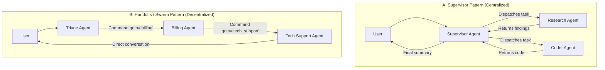

<div align="left">

[](https://github.com/Charan-Tj/LED-Ticker-GIF-Generator)

</div>

> **Target Framework Versions:**  
> - `langchain`: `>=1.0.0` (Developer framework, core abstractions, and `create_agent` minimal harness)  
> - `langchain-core`: `>=0.3.0` (Base interfaces, messages, and runnables)  
> - `langgraph`: `>=0.2.0` (up to `langgraph>=1.1.x`, stateful cyclical orchestration runtime)  
> - `deepagents`: `>=0.7.0` (Opinionated batteries-included agent harness: filesystem, subagents, planning)  
> - `managed-deepagents`: `>=0.1.0` (Hosted LangSmith runtime CLI and serverless deployments)  
> - `langchain-google-genai`: `>=2.0.0` (Google Gemini model provider integration — primary default)  
> - `langchain-openai`: `>=0.2.0` (OpenAI model provider integration)  
> - `langchain-anthropic`: `>=0.3.0` (Anthropic Claude model provider integration)  
> - `langchain-ollama`: `>=0.2.0` (Local offline Ollama model integration)  
>  
 

---

## Table of Contents

0. [Part 0 — Orientation](#part-0--orientation)
   - [0.1 What Problem This Stack Solves](#01-what-problem-this-stack-solves)
   - [0.2 The 4-Layer Stack Architecture](#02-the-4-layer-stack-architecture)
   - [0.3 Capabilities at a Glance: LangChain vs. LangGraph](#03-capabilities-at-a-glance-langchain-vs-langgraph)
   - [0.4 Where Used: Scenario Decision Matrix](#04-where-used-scenario-decision-matrix)
1. [Part 1 — Prerequisites & AI Foundations](#part-1--prerequisites--ai-foundations)
   - [1.1 Environment Setup (Python & Virtual Environments)](#11-environment-setup-python--virtual-environments)
   - [1.2 API Keys & Environment Management](#12-api-keys--environment-management)
   - [1.3 Core AI Concepts for Beginners](#13-core-ai-concepts-for-beginners)
   - [1.4 Essential Python Concepts: Async & JSON](#14-essential-python-concepts-async--json)
2. [Part 2 — LangChain Core](#part-2--langchain-core)
   - [2.1 Models (Chat Models vs. Legacy LLMs)](#21-models-chat-models-vs-legacy-llms)
   - [2.2 Messages](#22-messages)
   - [2.3 Prompt Templates (`ChatPromptTemplate`)](#23-prompt-templates-chatprompttemplate)
   - [2.4 Structured Output & Output Parsers](#24-structured-output--output-parsers)
   - [2.5 Runnables & LCEL (LangChain Expression Language)](#25-runnables--lcel-langchain-expression-language)
   - [2.6 Memory Fundamentals (Short-Term vs. Long-Term)](#26-memory-fundamentals-short-term-vs-long-term)
   - [2.7 Document Loaders, Embeddings & Vector Stores (RAG)](#27-document-loaders-embeddings--vector-stores-rag)
   - [2.8 High-Level Agents (`create_agent`)](#28-high-level-agents-create_agent)
   - [2.9 Observability & Tracing with LangSmith](#29-observability--tracing-with-langsmith)
3. [Part 3 — LangGraph Core](#part-3--langgraph-core)
   - [3.1 Graph Anatomy: State, Nodes, and Edges](#31-graph-anatomy-state-nodes-and-edges)
   - [3.2 State Schemas & TypedDict](#32-state-schemas--typeddict)
   - [3.3 Reducers & State Accumulation (`add_messages`)](#33-reducers--state-accumulation-add_messages)
   - [3.4 Conditional Routing (`add_conditional_edges`)](#34-conditional-routing-add_conditional_edges)
   - [3.5 Parallel Fan-Out with `Send` (Map-Reduce)](#35-parallel-fan-out-with-send-map-reduce)
   - [3.6 State Updates & Navigation with `Command`](#36-state-updates--navigation-with-command)
   - [3.7 Persistence & Checkpointers (`InMemorySaver`)](#37-persistence--checkpointers-inmemorysaver)
   - [3.8 Time Travel: Replay and Forking](#38-time-travel-replay-and-forking)
   - [3.9 Streaming Execution Events](#39-streaming-execution-events)
   - [3.10 Human-in-the-Loop Basics (`interrupt`)](#310-human-in-the-loop-basics-interrupt)
   - [3.11 Subgraphs & Composition](#311-subgraphs--composition)
4. [Part 4 — Tool Orchestration](#part-4--tool-orchestration)
   - [4.1 What Tools Are & Defining Them](#41-what-tools-are--defining-them)
   - [4.2 The Tool-Calling Loop: Request to Response](#42-the-tool-calling-loop-request-to-response)
   - [4.3 Binding Tools to Models & Tool Choice](#43-binding-tools-to-models--tool-choice)
   - [4.4 ToolNode, tools_condition & Building a ReAct Agent from Scratch](#44-toolnode-tools_condition--building-a-react-agent-from-scratch)
   - [4.5 Multi-Tool Orchestration: Sequential, Parallel & Conditional](#45-multi-tool-orchestration-sequential-parallel--conditional)
   - [4.6 Error Handling, Retries, Timeouts & Input Validation](#46-error-handling-retries-timeouts--input-validation)
   - [4.7 Tools that Read/Write Graph State: `ToolRuntime` & `Command`](#47-tools-that-readwrite-graph-state-toolruntime--command)
   - [4.8 Human Approval Before Sensitive Tool Calls (Interrupts)](#48-human-approval-before-sensitive-tool-calls-interrupts)
   - [4.9 Model Context Protocol (MCP) Integration](#49-model-context-protocol-mcp-integration)
   - [4.10 Best Practices, Common Pitfalls & LangSmith Tracing](#410-best-practices-common-pitfalls--langsmith-tracing)
5. [Part 5 — Multi-Agent & Deep Agents](#part-5--multi-agent--deep-agents)
   - [5.1 Multi-Agent Orchestration: Supervisor vs. Handoffs (Swarm)](#51-multi-agent-orchestration-supervisor-vs-handoffs-swarm)
   - [5.2 Deep Agents Orchestration: Subagents (`task`), Planning (`write_todos`), and LangGraph Subagents (`CompiledSubAgent`)](#52-deep-agents-orchestration-subagents-task-planning-write_todos-and-langgraph-subagents-compiledsubagent)
6. [Part 6 — Production Topics](#part-6--production-topics)
   - [6.1 Production Deployment: LangSmith Deployment & Managed Deep Agents (MDA)](#61-production-deployment-langsmith-deployment--managed-deep-agents-mda)
   - [6.2 Observability & Monitoring with LangSmith](#62-observability--monitoring-with-langsmith)
   - [6.3 Testing & Evaluation](#63-testing--evaluation)
   - [6.4 Cost & Latency Optimization](#64-cost--latency-optimization)
7. [Part 7 — Reference](#part-7--reference)
   - [7.1 Alphabetical Glossary of Core Terms](#71-alphabetical-glossary-of-core-terms)
   - [7.2 Links to Official Documentation](#72-links-to-official-documentation)
   - [7.3 Verified Image Attribution List](#73-verified-image-attribution-list)

---

# Part 0 — Orientation

## 0.1 What Problem This Stack Solves

Standard Large Language Models (LLMs) are stateless, text-in-text-out functions. Building real-world AI applications requires transforming unstructured language into validated domain data, coordinating external APIs and databases, maintaining multi-turn context across days or weeks, and orchestrating complex multi-step reasoning with human supervision. The modern ecosystem solves this by decoupling responsibilities into four distinct architectural layers: **LangGraph** serves as the stateful, durable execution runtime; **LangChain** provides the standard interfaces, prompt templates, structured output wrappers, and minimal ReAct agent harness; the **Deep Agents SDK** supplies an opinionated, batteries-included harness featuring virtual filesystems, planning tools, and subagents for context quarantine; and **Managed Deep Agents (MDA)** delivers a hosted, serverless deployment runtime running directly on LangSmith Agent Server.

---

## 0.2 The 4-Layer Stack Architecture


*Caption: The 4-tier stack hierarchy: LangGraph powers execution under the hood, LangChain provides component abstractions, Deep Agents packages opinionated agent capabilities, and Managed Deep Agents operates the production server.*

---

## 0.3 Capabilities at a Glance: LangChain vs. LangGraph

#### LangChain Capabilities
* **Standardized Model Interfaces:** Uniform wrapper for chat models across providers (OpenAI, Anthropic, Google, Ollama).
* **Messages & Formatting:** First-class message classes (`SystemMessage`, `HumanMessage`, `AIMessage`, `ToolMessage`).
* **Prompt Templates:** Parameterized dynamic variable substitution and validation via `ChatPromptTemplate`.
* **Structured Output:** Guaranteed type-safe JSON extraction conforming to Pydantic schemas via `.with_structured_output()`.
* **LCEL Composition:** Declarative pipe syntax (`|`) implementing the unified `Runnable` protocol (`invoke`, `stream`, `batch`, `ainvoke`).
* **Memory Abstractions:** Short-term thread memory and cross-thread persistence with `InMemoryStore` and `BaseStore`.
* **Retrieval & RAG:** Standard document loaders, text splitters, embeddings, and vector store retrievers.
* **Ready-Made Agent Harness:** Minimal out-of-the-box ReAct tool-calling agent via `create_agent`.
* **Observability:** Native zero-configuration telemetry and tracing integration with LangSmith.

#### LangGraph Capabilities
* **Cyclical Stateful Graphs:** Stateful graph execution with nodes, static edges, and conditional routing (`add_conditional_edges`).
* **State Schemas & TypedDict:** Centralized state tracking with type-safe channels across graph execution.
* **Reducers:** Accumulation logic (e.g., `add_messages`) to append messages or merge dictionaries rather than overwriting state.
* **Parallel Fan-Out (`Send`):** Dynamic map-reduce worker dispatching across parallel tasks without blocking.
* **Unified Control Flow (`Command`):** Combined state updates and routing transitions in a single atomic return.
* **Durable Persistence:** Checkpointer engines (`InMemorySaver`, `PostgresSaver`) saving snapshots at every super-step.
* **Time Travel:** State inspection, thread history replay, and state forking to correct agent mistakes.
* **Real-Time Streaming:** Dual streaming modes (`stream_mode="values"` for state snapshots, `stream_mode="updates"` for incremental node updates).
* **Human-in-the-Loop:** In-node execution suspension via `interrupt()` and resumption via `Command(resume=...)`.
* **Hierarchical Subgraphs:** Embedding compiled subgraphs directly as nodes inside parent workflows.

---

## 0.4 Where Used: Scenario Decision Matrix

| Application Scenario | Recommended Framework / Layer | Architectural Reason (Why) |
| :--- | :--- | :--- |
| **Structured Data Extraction** | **LangChain** (`prompt \| model \| parser`) | Single-pass linear chain transforming unstructured text into a validated Pydantic model. |
| **Basic Question-Answering RAG** | **LangChain** (`retriever \| prompt \| model`) | Linear pipeline: retrieve top-k documents and synthesize an answer in one pass. |
| **Multi-Provider Prototyping** | **LangChain** | Standardized model wrappers allow swapping providers (OpenAI, Anthropic, Google) with zero code changes. |
| **Cyclic ReAct Agent Loops** | **LangGraph** (`StateGraph` / `ToolNode`) | Reasoning loops requiring tool execution, output inspection, error recovery, and next-step decisions. |
| **Long-Running Persistent Chats** | **LangGraph** (with checkpointers) | Resilient multi-turn conversations that survive server restarts and store history in PostgreSQL/SQLite. |
| **Human Approval / High-Stakes Actions** | **LangGraph** (`interrupt`) | Execution pauses mid-workflow before sensitive operations (payments, SQL edits) awaiting human review. |
| **Complex Multi-Step Autonomous Tasks** | **Deep Agents SDK** (`create_deep_agent`) | Batteries-included harness with virtual filesystem, structured planning (`write_todos`), and context management. |
| **Heavy Tool Outputs / Context Bloat** | **Deep Agents SDK** (`task` subagents) | Context quarantine: delegates research/code execution to isolated child subagents, keeping main context clean. |
| **Zero-Infrastructure Production Agents** | **Managed Deep Agents** (MDA) | Serverless deployment on LangSmith Agent Server with scheduled runs, sandboxes, and MCP endpoints via `mda`. |

---

# Part 1 — Prerequisites & AI Foundations

## 1.1 Environment Setup (Python & Virtual Environments)
* **One-line Definition:** An isolated directory containing a dedicated Python binary and library set to avoid system-wide package version conflicts.
* **Why it exists:** Modern AI libraries publish frequent releases; keeping dependencies locked per project avoids breaking your system tools.

### Step-by-Step Installation Commands

#### Step 1: Verify Python & Install `uv`
```bash
# Verify Python version (Python 3.10 to 3.13 is officially supported)
python --version

# Install uv (ultra-fast package installer & resolver)
pip install uv

# Standalone installer alternatives:
# Windows (PowerShell): powershell -ExecutionPolicy ByPass -c "irm https://astral.sh/uv/install.ps1 | iex"
# macOS / Linux:        curl -LsSf https://astral.sh/uv/install.sh | sh
```

#### Step 2: Create & Activate Virtual Environment
```bash
# Create an isolated virtual environment named '.venv' with uv (Recommended)
uv venv .venv

# (Fallback with standard Python: python -m venv .venv)

# Activate the virtual environment
# On Windows (PowerShell):
.venv\Scripts\Activate.ps1
# On Windows (Command Prompt cmd.exe):
.venv\Scripts\activate.bat
# On Linux / macOS (bash/zsh):
source .venv/bin/activate
```

#### Step 3: Install Core Libraries (`pip` or `uv`)

<details open>
<summary>⚡ <b>Option A: Install via uv (Default / Recommended)</b></summary>

Use `uv` for ultra-fast package management and dependency resolution:

```bash
# Core packages (LangChain, LangGraph, Deep Agents) + Google Gemini provider:
uv pip install -U "langchain>=1.0.0" "langchain-core>=0.3.0" "langgraph>=0.2.0" "deepagents>=0.7.0" "langchain-google-genai>=2.0.0" python-dotenv

# Optional developer tooling and alternative providers:
# uv pip install -U "langchain[mcp]" "langgraph-cli[inmem]" "langchain-openai>=0.2.0" "langchain-anthropic>=0.3.0"
```

</details>

<details>
<summary>📋 <b>Option B: Install via pip (Standard)</b></summary>

If you prefer standard `pip`, upgrade it first and install the packages:

```bash
# Upgrade pip to latest
pip install --upgrade pip

# Core packages + Google Gemini provider:
pip install -U "langchain>=1.0.0" "langchain-core>=0.3.0" "langgraph>=0.2.0" "deepagents>=0.7.0" "langchain-google-genai>=2.0.0" python-dotenv

# Optional developer tooling and alternative providers:
# pip install -U "langchain[mcp]" "langgraph-cli[inmem]" "langchain-openai>=0.2.0" "langchain-anthropic>=0.3.0"
```

</details>

#### Step 4: Verify Your Installation
Run this quick terminal one-liner to verify all packages are correctly recognized:
```bash
python -c "import langchain, langgraph, langchain_core; print('LangChain:', langchain.__version__); print('LangGraph:', langgraph.__version__); print('LangChain-Core:', langchain_core.__version__)"
```

* **Expected Output:**
```text
LangChain: 1.x.x
LangGraph: 0.2.x (or 1.1.x)
LangChain-Core: 0.3.x
```

* **Common Mistake to Avoid:** Running `pip install` without activating the virtual environment. Always confirm your terminal prompt displays `(.venv)`.
* **Read more in official docs:** [Install LangChain](https://python.langchain.com/docs/introduction/) | [Install LangGraph](https://langchain-ai.github.io/langgraph/tutorials/introduction/)

---

## 1.2 API Keys & Environment Management
* **One-line Definition:** Secret authorization strings issued by model providers (like OpenAI or Anthropic) that allow your application to call hosted model APIs.
* **Why it exists:** Model execution requires expensive GPU cloud servers; API keys identify your account, bill usage, and protect against unauthorized access.
* **Setup:** Create a `.env` file in your project root with your credentials:

<details open>
<summary>🔷 <b>Option A: Google Gemini API Key (Default / Recommended)</b></summary>
<br>

Get your free or paid API key from [Google AI Studio](https://aistudio.google.com/):

```env
GOOGLE_API_KEY=AIzaSyYourActualKeyHere
LANGSMITH_TRACING=true
LANGSMITH_API_KEY=lsv2_pt_yourLangSmithKeyHere
```

</details>

<details>
<summary>🟢 <b>Option B: OpenAI API Key</b></summary>
<br>

Get your key from [OpenAI Platform](https://platform.openai.com/api-keys):

```env
OPENAI_API_KEY=sk-proj-yourActualKeyHere
LANGSMITH_TRACING=true
LANGSMITH_API_KEY=lsv2_pt_yourLangSmithKeyHere
```

</details>

<details>
<summary>🟠 <b>Option C: Anthropic Claude API Key</b></summary>
<br>

Get your key from [Anthropic Console](https://console.anthropic.com/):

```env
ANTHROPIC_API_KEY=sk-ant-yourActualKeyHere
LANGSMITH_TRACING=true
LANGSMITH_API_KEY=lsv2_pt_yourLangSmithKeyHere
```

</details>

<details>
<summary>🦙 <b>Option D: Local Models via Ollama (Free & Offline)</b></summary>
<br>

No API key required! Install [Ollama](https://ollama.com/) and run `ollama run llama3.2`.

</details>

* **Minimal Runnable Example:**

```python
import os
from dotenv import load_dotenv

# Load key-value pairs from .env into os.environ
load_dotenv()

# Verify primary provider key (Google Gemini) or alternatives
api_key = os.getenv("GOOGLE_API_KEY") or os.getenv("OPENAI_API_KEY") or os.getenv("ANTHROPIC_API_KEY")
if not api_key:
    raise ValueError("Model provider API key is missing from environment or .env file.")

print("Provider API key successfully detected.")
```
* **Expected Output:**
```text
Provider API key successfully detected.
```
* **Common Mistake to Avoid:** Hardcoding API keys directly into Python code strings. Always read keys from environment variables and add `.env` to `.gitignore`.
* **Read more in official docs:** [Provider Credentials](https://python.langchain.com/docs/concepts/chat_models/)

---

## 1.3 Core AI Concepts for Beginners

### A. Large Language Model (LLM)
* **One-line Definition:** A neural network trained on vast text data to predict the most statistically probable next token in a sequence.
* **Analogy:** High-powered autocomplete that has indexed internet knowledge and can reason over novel questions.
* **Why it exists:** Enables computers to parse unstructured natural language, write code, answer questions, and make decisions without explicit hardcoded rules.

### B. Prompt
* **One-line Definition:** The input text, system instructions, and context passed to an LLM to elicit a desired response.
* **Analogy:** The assignment briefing document given to a researcher detailing the task, rules, and background material.
* **Why it exists:** LLMs are general-purpose engines; prompts guide their attention to the specific domain and style required.

### C. Token
* **One-line Definition:** The basic unit of text processed by an LLM, typically corresponding to 3–4 characters or roughly 0.75 English words.
* **Analogy:** If words are LEGO structures, tokens are the individual standard LEGO bricks.
* **Why it exists:** Neural networks process numerical matrices, so raw text is segmented into discrete integer token IDs.

### D. Embedding
* **One-line Definition:** A high-dimensional vector (array of numbers) that captures the semantic meaning of a word, sentence, or document.
* **Analogy:** A multidimensional coordinate map where concepts with similar meanings sit physically close together.
* **Why it exists:** Enables semantic similarity search, allowing queries to match relevant documents even when using different words.
* **Read more in official docs:** [LangChain Overview](https://python.langchain.com/docs/concepts/)

---

## 1.4 Essential Python Concepts: Async & JSON

### A. JSON (JavaScript Object Notation)
* **One-line Definition:** A standardized text-based format for exchanging structured key-value data.
* **Why it exists:** LLM function calling and structured outputs use JSON to transfer structured arguments to client code.
* **Minimal Runnable Example:**

```python
import json

raw_json = '{"service": "WeatherAPI", "status": "operational", "latency_ms": 42}'
parsed = json.loads(raw_json)
print(f"Service: {parsed['service']}, Status: {parsed['status']}")
```
* **Expected Output:**
```text
Service: WeatherAPI, Status: operational
```

### B. Async (Asynchronous Programming)
* **One-line Definition:** A concurrency design allowing Python to pause a task waiting on network I/O (such as an LLM HTTP response) and execute other tasks in parallel.
* **Analogy:** A chef who chops vegetables while water boils, rather than standing idle watching the pot.
* **Minimal Runnable Example:**

```python
import asyncio

async def fetch_data(source: str) -> str:
    print(f"Querying {source}...")
    await asyncio.sleep(0.5)  # Simulate non-blocking network wait
    return f"Data from {source}"

async def main():
    task1 = fetch_data("Database")
    task2 = fetch_data("SearchEngine")
    results = await asyncio.gather(task1, task2)
    print("Results:", results)

asyncio.run(main())
```
* **Expected Output:**
```text
Querying Database...
Querying SearchEngine...
Results: ['Data from Database', 'Data from SearchEngine']
```
* **Common Mistake to Avoid:** Invoking an async function without `await`, which produces an unawaited coroutine warning instead of executing the code.
* **Read more in official docs:** [LangChain Runtime](https://python.langchain.com/docs/concepts/)

---

# Part 2 — LangChain Core

## 2.1 Models (Chat Models vs. Legacy LLMs)
* **One-line Definition:** A chat model is an API wrapper that accepts structured messages and returns an `AIMessage` containing text and/or structured tool calls.
* **Why it exists:** Modern language models are trained on conversational message exchanges; chat models handle role serialization, authentication, and provider-specific payload schemas.

### Multi-Provider Model Initialization

<details open>
<summary>🔷 <b>Option A: Google Gemini (Default / Recommended)</b></summary>
<br>

```python
from langchain_google_genai import ChatGoogleGenerativeAI

# Primary default model used across this guide
model = ChatGoogleGenerativeAI(
    model="gemini-2.5-flash",
    temperature=0
)
```

</details>

<details>
<summary>🟢 <b>Option B: OpenAI</b></summary>

```python
from langchain_openai import ChatOpenAI

model = ChatOpenAI(
    model="gpt-4o-mini",
    temperature=0
)
```

</details>

<details>
<summary>🟠 <b>Option C: Anthropic Claude</b></summary>
<br>

```python
from langchain_anthropic import ChatAnthropic

model = ChatAnthropic(
    model="claude-3-7-sonnet-latest",
    temperature=0
)
```

</details>

<details>
<summary>🦙 <b>Option D: Local Offline Models (Ollama - Free)</b></summary>
<br>

```python
from langchain_ollama import ChatOllama

model = ChatOllama(
    model="llama3.2",
    temperature=0
)
```

</details>

* **Minimal Runnable Example:**

```python
import os
from dotenv import load_dotenv
from langchain_google_genai import ChatGoogleGenerativeAI

load_dotenv()

# Setting temperature=0 reduces randomness to produce more deterministic answers
model = ChatGoogleGenerativeAI(model="gemini-2.5-flash", temperature=0)

response = model.invoke("What are the two primary colors that combine to create purple?")

print("Content:", response.content.strip())
print("Type:", type(response).__name__)
```
* **Expected Output:**
```text
Content: Red and blue.
Type: AIMessage
```
* **Common Mistake to Avoid:** Importing models from the deprecated `langchain.chat_models`. Always import from dedicated partner packages like `langchain_google_genai`, `langchain_openai`, or `langchain_anthropic`.
* **Read more in official docs:** [Chat Models Guide](https://docs.langchain.com/oss/python/langchain/models)

---

## 2.2 Messages
* **One-line Definition:** Structured Python classes representing the different roles in a conversation (`SystemMessage`, `HumanMessage`, `AIMessage`, and `ToolMessage`).
* **Why it exists:** Clearly partitions instructions, user inputs, assistant thoughts, and tool execution outputs into distinct roles expected by chat APIs.
* **Minimal Runnable Example:**

```python
import os
from dotenv import load_dotenv
from langchain_google_genai import ChatGoogleGenerativeAI
from langchain_core.messages import SystemMessage, HumanMessage

load_dotenv()
model = ChatGoogleGenerativeAI(model="gemini-2.5-flash", temperature=0)

messages = [
    SystemMessage(content="You are a strict physics professor. Respond in exactly one concise sentence."),
    HumanMessage(content="What is inertia?"),
]

response = model.invoke(messages)
print(response.content)
```
* **Expected Output:**
```text
Inertia is the tendency of an object to resist any change in its velocity unless acted upon by an external force.
```
* **Common Mistake to Avoid:** Passing a plain Python dictionary without converting it, or passing an unstructured string when multi-turn conversation context is required.
* **Read more in official docs:** [Messages Guide](https://python.langchain.com/docs/concepts/messages/)

---

## 2.3 Prompt Templates (`ChatPromptTemplate`)
* **One-line Definition:** Parameterized templates that generate formatted lists of messages from dynamic runtime variables.
* **Why it exists:** Standardizes prompt composition and prevents manual, error-prone string formatting across your codebase.
* **Minimal Runnable Example:**

```python
from langchain_core.prompts import ChatPromptTemplate

prompt = ChatPromptTemplate.from_messages([
    ("system", "You are an expert translator specializing in {target_language}."),
    ("human", "Translate this phrase: '{text}'"),
])

formatted_messages = prompt.format_messages(target_language="French", text="Good morning, friend!")
for msg in formatted_messages:
    print(f"[{msg.type.upper()}]: {msg.content}")
```
* **Expected Output:**
```text
[SYSTEM]: You are an expert translator specializing in French.
[HUMAN]: Translate this phrase: 'Good morning, friend!'
```
* **Common Mistake to Avoid:** Missing template variables during `.format_messages()`, which raises a `KeyError`.
* **Read more in official docs:** [Messages and Prompts](https://python.langchain.com/docs/concepts/messages/)

---

## 2.4 Structured Output & Output Parsers
* **One-line Definition:** A technique that forces the chat model to return JSON strictly conforming to a Pydantic schema or TypedDict.
* **Why it exists:** Eliminates fragile regular expressions by guaranteeing that model responses can be directly unpacked into validated Python data structures.
* **Minimal Runnable Example:**

```python
import os
from dotenv import load_dotenv
from pydantic import BaseModel, Field
from langchain_google_genai import ChatGoogleGenerativeAI

load_dotenv()
model = ChatGoogleGenerativeAI(model="gemini-2.5-flash", temperature=0)

class BookInfo(BaseModel):
    title: str = Field(description="The full title of the book")
    author: str = Field(description="The primary author")
    publication_year: int = Field(description="Year first published")

# Bind Pydantic model directly to the chat model
structured_llm = model.with_structured_output(BookInfo)

result = structured_llm.invoke("Tell me about George Orwell's 1984.")
print(f"Title: {result.title} | Author: {result.author} | Year: {result.publication_year}")
print("Parsed type:", type(result).__name__)
```
* **Expected Output:**
```text
Title: 1984 | Author: George Orwell | Year: 1949
Parsed type: BookInfo
```
* **Common Mistake to Avoid:** Asking the LLM to output JSON in natural language without using `.with_structured_output()`. Models can fail formatting without schema constraints.
* **Read more in official docs:** [Structured Output](https://python.langchain.com/docs/how_to/structured_output/)

---

## 2.5 Runnables & LCEL (LangChain Expression Language)
* **One-line Definition:** A declarative composition syntax using the pipe operator (`|`) to link components into an executable pipeline.
* **Why it exists:** Provides a unified interface supporting synchronous execution (`invoke`), streaming (`stream`), batching (`batch`), and async calls (`ainvoke`).
* **Minimal Runnable Example:**

```python
import os
from dotenv import load_dotenv
from langchain_google_genai import ChatGoogleGenerativeAI
from langchain_core.prompts import ChatPromptTemplate
from langchain_core.output_parsers import StrOutputParser

load_dotenv()
model = ChatGoogleGenerativeAI(model="gemini-2.5-flash", temperature=0)

prompt = ChatPromptTemplate.from_messages([
    ("system", "You are a concise geography expert."),
    ("human", "What is the capital of {country}? Answer in one word."),
])

# Compose via LCEL pipe syntax
chain = prompt | model | StrOutputParser()

output = chain.invoke({"country": "Japan"})
print("Chain output:", output.strip())
```
* **Expected Output:**
```text
Chain output: Tokyo
```
* **Common Mistake to Avoid:** Trying to pipe objects that do not implement the `Runnable` protocol. Standard prompts, models, and parsers all implement `Runnable`.
* **Read more in official docs:** [LCEL Guide](https://python.langchain.com/docs/concepts/)

---

## 2.6 Memory Fundamentals (Short-Term vs. Long-Term)
* **One-line Definition:** The storage layer that allows AI applications to retain information across conversation turns (short-term) or across distinct sessions and days (long-term).
* **Why it exists:** Chat models are inherently stateless; memory preserves context so users do not have to repeat themselves.

| Memory Type | Scope | Storage Mechanism | Example Use Case |
| :--- | :--- | :--- | :--- |
| **Short-Term Memory** | Current conversation thread | Graph state (`MessagesState`) & Checkpointer (`InMemorySaver`) | Tracking the current multi-turn troubleshooting dialog |
| **Long-Term Memory** | Across multiple threads / sessions | Persistent Store (`BaseStore`, `InMemoryStore`, `PostgresStore`) | Remembering a user's language preference or bio across days |

* **Minimal Runnable Example:**

```python
from langgraph.store.memory import InMemoryStore

# Initialize long-term memory store
store = InMemoryStore()

# Store user profile under namespace ('users',) with key 'user_42'
store.put(("users",), "user_42", {"name": "Alice", "preferred_language": "Spanish"})

# Retrieve user profile in a future session
profile = store.get(("users",), "user_42")
print("Retrieved long-term memory:", profile.value)
```
* **Expected Output:**
```text
Retrieved long-term memory: {'name': 'Alice', 'preferred_language': 'Spanish'}
```
* **Common Mistake to Avoid:** Storing permanent user preferences only in message history. Message histories get truncated or summarized; use a persistent `Store` for long-term data.
* **Read more in official docs:** [Short-term Memory](https://python.langchain.com/docs/concepts/#memory) | [Long-term Memory](https://python.langchain.com/docs/concepts/#memory)

---

## 2.7 Document Loaders, Embeddings & Vector Stores (RAG)
* **One-line Definition:** A pipeline that converts text into vector embeddings, stores them, and retrieves semantically relevant context to ground LLM answers.
* **Why it exists:** Keeps model responses accurate and up to date with private or specialized organizational documents.
* **Minimal Runnable Example:**

```python
import os
from dotenv import load_dotenv
from langchain_core.vectorstores import InMemoryVectorStore
from langchain_google_genai import GoogleGenerativeAIEmbeddings

load_dotenv()
embeddings = GoogleGenerativeAIEmbeddings(model="models/text-embedding-004")
vector_store = InMemoryVectorStore(embeddings)

# Index private domain knowledge
documents = [
    "AeroTech Flight System uses hybrid ion propulsion.",
    "AeroTech fuel mixture consists of 70% helium-3 and 30% xenon.",
    "Standard clearance code for AeroTech craft is VECTOR-9.",
]
vector_store.add_texts(documents)

# Create a retriever to search the top matching document
retriever = vector_store.as_retriever(search_kwargs={"k": 1})
results = retriever.invoke("What fuel mixture does the craft use?")

print("Retrieved context:", results[0].page_content)
```
* **Expected Output:**
```text
Retrieved context: AeroTech fuel mixture consists of 70% helium-3 and 30% xenon.
```
* **Common Mistake to Avoid:** Passing massive documents without chunking them into manageable segments, which degrades retrieval accuracy.
* **Read more in official docs:** [Retrieval & RAG](https://python.langchain.com/docs/tutorials/rag/)

---

## 2.8 High-Level Agents (`create_agent`)
* **One-line Definition:** The official LangChain factory function that wraps a model, tools, and system instructions into an autonomous agent harness.
* **Why it exists:** Provides an out-of-the-box agent loop without requiring manual node and edge graph assembly for standard tool-calling agents.
* **Note on Architecture:** `create_agent` runs on LangGraph under the hood. It accepts model instances (e.g. `ChatOpenAI(model="gpt-4o-mini")`) or string specifiers (e.g. `"openai:gpt-4o-mini"`).
* **Minimal Runnable Example:**

```python
import os
from dotenv import load_dotenv
from langchain.agents import create_agent
from langchain.tools import tool
from langchain_google_genai import ChatGoogleGenerativeAI

load_dotenv()
model = ChatGoogleGenerativeAI(model="gemini-2.5-flash", temperature=0)

@tool
def calculate_area(length: float, width: float) -> float:
    """Calculates the area of a rectangle given length and width."""
    return length * width

agent = create_agent(
    model=model,
    tools=[calculate_area],
    system_prompt="You are a helpful geometry assistant.",
)

result = agent.invoke({
    "messages": [{"role": "user", "content": "What is the area of a room 12 meters long and 8 meters wide?"}]
})
print("Agent response:", result["messages"][-1].content)
```
* **Expected Output:**
```text
Agent response: The area of the room is 96 square meters.
```
* **Common Mistake to Avoid:** Using legacy `initialize_agent` or `AgentExecutor`. Use `create_agent` or native LangGraph workflows.
* **Read more in official docs:** [Agents Guide](https://python.langchain.com/docs/tutorials/agents/)

---

## 2.9 Observability & Tracing with LangSmith
* **One-line Definition:** A dedicated platform for tracing, evaluating, and monitoring LLM and agent runs end-to-end.
* **Why it exists:** Multi-step agents execute non-deterministic loops; LangSmith lets you inspect exact prompts, token counts, tool inputs/outputs, and latency per step.
* **Minimal Runnable Example:**

```python
import os

# Enable LangSmith tracing via environment variables
os.environ["LANGSMITH_TRACING"] = "true"
os.environ["LANGSMITH_PROJECT"] = "Agent-Testing"

print("LangSmith Tracing configured. All downstream LangChain/LangGraph calls will be logged.")
```
* **Expected Output:**
```text
LangSmith Tracing configured. All downstream LangChain/LangGraph calls will be logged.
```
* **Common Mistake to Avoid:** Forgetting to set `LANGSMITH_API_KEY`, which causes runs to execute locally without publishing trace records to the dashboard.
* **Read more in official docs:** [LangSmith Observability](https://docs.smith.langchain.com/)

---

# Part 3 — LangGraph Core

## 3.1 Graph Anatomy: State, Nodes, and Edges
* **One-line Definition:** LangGraph coordinates agent workflows as state machines where **State** is the shared memory, **Nodes** are Python functions doing work, and **Edges** direct execution flow.
* **Why it exists:** Provides fine-grained control to combine deterministic business logic with autonomous LLM reasoning loops.



* **Read more in official docs:** [Graph API Overview](https://langchain-ai.github.io/langgraph/concepts/low_level/)

---

## 3.2 State Schemas & TypedDict
* **One-line Definition:** A Python `TypedDict` or Pydantic class defining the structure and data types of the state channels maintained during graph execution.
* **Why it exists:** Ensures all nodes share a type-safe contract for reading and writing data.
* **Minimal Runnable Example:**

```python
from typing import TypedDict
from langgraph.graph import StateGraph, START, END

class OrderState(TypedDict):
    item: str
    quantity: int
    total_price: float

def price_calculator(state: OrderState) -> dict:
    unit_price = 15.0
    return {"total_price": state["quantity"] * unit_price}

builder = StateGraph(OrderState)
builder.add_node("calculate", price_calculator)
builder.add_edge(START, "calculate")
builder.add_edge("calculate", END)

graph = builder.compile()
output = graph.invoke({"item": "Keyboard", "quantity": 3, "total_price": 0.0})
print(output)
```
* **Expected Output:**
```text
{'item': 'Keyboard', 'quantity': 3, 'total_price': 45.0}
```
* **Common Mistake to Avoid:** Returning the entire unmodified state dictionary from a node. Nodes only need to return the specific keys they wish to update.
* **Read more in official docs:** [Graph API: State](https://langchain-ai.github.io/langgraph/concepts/low_level/#state)

---

## 3.3 Reducers & State Accumulation (`add_messages`)
* **One-line Definition:** A reducer function defines how new values returned by a node are merged into an existing state channel (e.g., appending messages instead of overwriting).
* **Why it exists:** By default, LangGraph overwrites state keys with the newly returned value. When tracking conversation history, messages must be appended and indexed by ID.
* **Minimal Runnable Example:**

```python
from typing import Annotated
from typing_extensions import TypedDict
from langchain_core.messages import BaseMessage, HumanMessage, AIMessage
from langgraph.graph import StateGraph, START, END
from langgraph.graph.message import add_messages

class ConversationState(TypedDict):
    messages: Annotated[list[BaseMessage], add_messages]

def assistant_node(state: ConversationState) -> dict:
    return {"messages": [AIMessage(content="Hello! How can I assist you today?")]}

builder = StateGraph(ConversationState)
builder.add_node("assistant", assistant_node)
builder.add_edge(START, "assistant")
builder.add_edge("assistant", END)

graph = builder.compile()
result = graph.invoke({"messages": [HumanMessage(content="Hi there!")]})

print(f"Total messages: {len(result['messages'])}")
for msg in result["messages"]:
    print(f"- {msg.type}: {msg.content}")
```
* **Expected Output:**
```text
Total messages: 2
- human: Hi there!
- ai: Hello! How can I assist you today?
```
* **Common Mistake to Avoid:** Omitting `Annotated[..., add_messages]`. Without a reducer, returning `{"messages": [new_msg]}` overwrites and wipes the prior chat history.
* **Read more in official docs:** [Graph API: Reducers](https://langchain-ai.github.io/langgraph/concepts/low_level/#reducers)

---

## 3.4 Conditional Routing (`add_conditional_edges`)
* **One-line Definition:** A dynamic edge whose destination node is evaluated at runtime by passing the current state to a router function.
* **Why it exists:** Allows agents to branch dynamically (e.g., routing to a tool node if tool calls exist, or terminating if the answer is ready).
* **Minimal Runnable Example:**

```python
from typing import TypedDict
from langgraph.graph import StateGraph, START, END

class TriageState(TypedDict):
    ticket_text: str
    department: str

def classify_ticket(state: TriageState) -> dict:
    if "refund" in state["ticket_text"].lower():
        return {"department": "billing"}
    return {"department": "technical"}

def route_ticket(state: TriageState) -> str:
    return state["department"]

def billing_node(state: TriageState) -> dict:
    return {"ticket_text": "Processed by Billing Desk"}

def tech_node(state: TriageState) -> dict:
    return {"ticket_text": "Processed by Tech Support"}

builder = StateGraph(TriageState)
builder.add_node("classifier", classify_ticket)
builder.add_node("billing", billing_node)
builder.add_node("technical", tech_node)

builder.add_edge(START, "classifier")
builder.add_conditional_edges(
    "classifier",
    route_ticket,
    {"billing": "billing", "technical": "technical"}
)
builder.add_edge("billing", END)
builder.add_edge("technical", END)

app = builder.compile()
print(app.invoke({"ticket_text": "I need a refund for my order", "department": ""}))
```
* **Expected Output:**
```text
{'ticket_text': 'Processed by Billing Desk', 'department': 'billing'}
```
* **Common Mistake to Avoid:** Returning a route string from the router function that does not match any entry in the mapping dictionary.
* **Read more in official docs:** [Graph API: Conditional Edges](https://langchain-ai.github.io/langgraph/concepts/low_level/#conditional-edges)

---

## 3.5 Parallel Fan-Out with `Send` (Map-Reduce)
* **One-line Definition:** A mechanism allowing conditional edges to dynamically spawn multiple parallel tasks, each receiving its own distinct state slice.
* **Why it exists:** When a node generates an unknown number of items (e.g., a list of documents or topics), `Send` enables dynamic parallel map-reduce processing without hardcoding edge counts.
* **Minimal Runnable Example:**

```python
from typing import Annotated
import operator
from typing_extensions import TypedDict
from langgraph.graph import StateGraph, START, END
from langgraph.types import Send

class OverallState(TypedDict):
    topics: list[str]
    results: Annotated[list[str], operator.add]

class WorkerState(TypedDict):
    topic: str

def generate_topics(state: OverallState) -> dict:
    return {"topics": ["quantum", "relativity", "thermodynamics"]}

def process_topic(state: WorkerState) -> dict:
    return {"results": [f"Summary for {state['topic']}"]}

def fan_out_topics(state: OverallState) -> list[Send]:
    return [Send("process_topic", {"topic": t}) for t in state["topics"]]

builder = StateGraph(OverallState)
builder.add_node("generate_topics", generate_topics)
builder.add_node("process_topic", process_topic)

builder.add_edge(START, "generate_topics")
builder.add_conditional_edges("generate_topics", fan_out_topics, ["process_topic"])
builder.add_edge("process_topic", END)

app = builder.compile()
output = app.invoke({"topics": [], "results": []})
print("Processed parallel results:", output["results"])
```
* **Expected Output:**
```text
Processed parallel results: ['Summary for quantum', 'Summary for relativity', 'Summary for thermodynamics']
```
* **Common Mistake to Avoid:** Omitting an accumulation reducer (like `operator.add`) on the target state channel when multiple parallel workers write back to the shared state.
* **Read more in official docs:** [Graph API: Send](https://langchain-ai.github.io/langgraph/concepts/low_level/#send)

---

## 3.6 State Updates & Navigation with `Command`
* **One-line Definition:** A unified control primitive returned from a node or tool to update state and designate the next node (`goto`) in a single step.
* **Why it exists:** Combines state updating and conditional routing into a single concise call, avoiding separate router functions.
* **Minimal Runnable Example:**

```python
from typing import Literal
from typing_extensions import TypedDict
from langgraph.graph import StateGraph, START, END
from langgraph.types import Command

class StepState(TypedDict):
    step_count: int

def step_one(state: StepState) -> Command[Literal["step_two", "__end__"]]:
    new_count = state["step_count"] + 1
    if new_count >= 2:
        return Command(update={"step_count": new_count}, goto=END)
    return Command(update={"step_count": new_count}, goto="step_two")

def step_two(state: StepState) -> Command[Literal["step_one"]]:
    return Command(update={"step_count": state["step_count"] + 1}, goto="step_one")

builder = StateGraph(StepState)
builder.add_node("step_one", step_one)
builder.add_node("step_two", step_two)
builder.add_edge(START, "step_one")

app = builder.compile()
print("Final state:", app.invoke({"step_count": 0}))
```
* **Expected Output:**
```text
Final state: {'step_count': 2}
```
* **Common Mistake to Avoid:** Defining both static edges (`add_edge`) and `Command(goto=...)` from the same node. Use either `Command` or static edges per node, not both.
* **Read more in official docs:** [Graph API: Command](https://langchain-ai.github.io/langgraph/concepts/low_level/#command)

---

## 3.7 Persistence & Checkpointers (`InMemorySaver`)
* **One-line Definition:** A persistence mechanism that saves a snapshot of graph state at each super-step boundary, organized into isolated threads.
* **Why it exists:** Enables conversation memory across turns, error recovery, time-travel debugging, and human-in-the-loop pauses.


* **Minimal Runnable Example:**

```python
from typing_extensions import TypedDict
from langgraph.graph import StateGraph, START, END
from langgraph.checkpoint.memory import InMemorySaver

class SessionState(TypedDict):
    user_name: str
    greeting: str

def greet_node(state: SessionState) -> dict:
    return {"greeting": f"Welcome back, {state['user_name']}!"}

builder = StateGraph(SessionState)
builder.add_node("greet", greet_node)
builder.add_edge(START, "greet")
builder.add_edge("greet", END)

# InMemorySaver stores thread checkpoints in memory (use PostgresSaver in production)
checkpointer = InMemorySaver()
app = builder.compile(checkpointer=checkpointer)

thread_config = {"configurable": {"thread_id": "user-session-101"}}
app.invoke({"user_name": "Charlie", "greeting": ""}, config=thread_config)

# Fetch persisted state snapshot
snapshot = app.get_state(thread_config)
print("Persisted greeting:", snapshot.values["greeting"])
```
* **Expected Output:**
```text
Persisted greeting: Welcome back, Charlie!
```
* **Common Mistake to Avoid:** Omitting `config={"configurable": {"thread_id": "..."}}`. The checkpointer requires a `thread_id` to index and retrieve state.
* **Read more in official docs:** [Checkpointers Guide](https://langchain-ai.github.io/langgraph/concepts/persistence/)

---

## 3.8 Time Travel: Replay and Forking
* **One-line Definition:** The ability to inspect a thread's past checkpoints, replay execution from an earlier point, or fork execution with modified state.
* **Why it exists:** Crucial for debugging multi-step agents, evaluating alternative LLM decision paths, and correcting mistakes.


* **Minimal Runnable Example:**

```python
from typing_extensions import TypedDict
from langgraph.graph import StateGraph, START, END
from langgraph.checkpoint.memory import InMemorySaver

class FlowState(TypedDict):
    step_label: str

def first_step(state: FlowState) -> dict:
    return {"step_label": "First"}

def second_step(state: FlowState) -> dict:
    return {"step_label": state["step_label"] + " -> Second"}

builder = StateGraph(FlowState)
builder.add_node("first", first_step)
builder.add_node("second", second_step)
builder.add_edge(START, "first")
builder.add_edge("first", "second")
builder.add_edge("second", END)

checkpointer = InMemorySaver()
app = builder.compile(checkpointer=checkpointer)
config = {"configurable": {"thread_id": "time-travel-1"}}

app.invoke({"step_label": "Init"}, config=config)

# Inspect state history in reverse chronological order
history = list(app.get_state_history(config))
print(f"Total recorded checkpoints: {len(history)}")
for state_snap in history:
    print(f"- Next node to run: {state_snap.next} | State: {state_snap.values}")
```
* **Expected Output:**
```text
Total recorded checkpoints: 3
- Next node to run: () | State: {'step_label': 'First -> Second'}
- Next node to run: ('second',) | State: {'step_label': 'First'}
- Next node to run: ('first',) | State: {'step_label': 'Init'}
```
* **Common Mistake to Avoid:** Expecting replaying a past checkpoint to return cached values. Replay re-executes subsequent nodes (including LLM calls and API queries).
* **Read more in official docs:** [Use Time-Travel](https://langchain-ai.github.io/langgraph/how-tos/human-in-the-loop-time-travel/)

---

## 3.9 Streaming Execution Events
* **One-line Definition:** Consuming execution events chunk-by-chunk in real time as the graph executes.
* **Why it exists:** Lowers perceived latency by showing users immediate progress, tokens, or node updates instead of blocking until graph completion.
* **Default Behavior Note:** The default `stream_mode` in LangGraph is `"values"`, which yields the **full state dictionary** after each super-step. To stream only the **incremental node updates**, specify `stream_mode="updates"`.
* **Minimal Runnable Example:**

```python
from typing_extensions import TypedDict
from langgraph.graph import StateGraph, START, END

class PipelineState(TypedDict):
    query: str
    status: str

def step_one(state: PipelineState) -> dict:
    return {"status": "analyzed"}

def step_two(state: PipelineState) -> dict:
    return {"status": "completed"}

builder = StateGraph(PipelineState)
builder.add_node("analyze", step_one)
builder.add_node("finish", step_two)
builder.add_edge(START, "analyze")
builder.add_edge("analyze", "finish")
builder.add_edge("finish", END)

app = builder.compile()

# Explicitly use stream_mode="updates" to receive node-by-node updates
for event in app.stream({"query": "Check order #100", "status": "pending"}, stream_mode="updates"):
    for node_name, state_update in event.items():
        print(f"Node '{node_name}' emitted update: {state_update}")
```
* **Expected Output:**
```text
Node 'analyze' emitted update: {'status': 'analyzed'}
Node 'finish' emitted update: {'status': 'completed'}
```
* **Common Mistake to Avoid:** Iterating over `event.items()` assuming node updates when calling `app.stream()` without specifying `stream_mode="updates"`. By default (`stream_mode="values"`), each chunk is the full state dictionary.
* **Read more in official docs:** [Streaming Guide](https://langchain-ai.github.io/langgraph/how-tos/streaming-tokens/)

---

## 3.10 Human-in-the-Loop Basics (`interrupt`)
* **One-line Definition:** An in-node function call that suspends execution, checkpoints current state, and yields control back to the caller until resumed with external input.
* **Why it exists:** Safeguards high-stakes actions (payments, database deletions, emails) by requiring human authorization before proceeding.
* **Minimal Runnable Example:**

```python
from typing_extensions import TypedDict
from langgraph.graph import StateGraph, START, END
from langgraph.types import interrupt, Command
from langgraph.checkpoint.memory import InMemorySaver

class PaymentState(TypedDict):
    amount: float
    approved: bool

def process_payment(state: PaymentState) -> dict:
    # Pause execution and request human review
    user_decision = interrupt({
        "prompt": f"Authorize charge of ${state['amount']}?",
    })
    return {"approved": user_decision}

builder = StateGraph(PaymentState)
builder.add_node("payment_gate", process_payment)
builder.add_edge(START, "payment_gate")
builder.add_edge("payment_gate", END)

checkpointer = InMemorySaver()
app = builder.compile(checkpointer=checkpointer)
config = {"configurable": {"thread_id": "tx-999"}}

# 1. Initial invoke pauses at the interrupt
app.invoke({"amount": 250.0, "approved": False}, config=config)
snapshot = app.get_state(config)
print("Execution paused. Active interrupt payload:", snapshot.tasks[0].interrupts[0].value)

# 2. Resume execution by passing Command(resume=...)
final_state = app.invoke(Command(resume=True), config=config)
print("Execution completed. Approved status:", final_state["approved"])
```
* **Expected Output:**
```text
Execution paused. Active interrupt payload: {'prompt': 'Authorize charge of $250.0?'}
Execution completed. Approved status: True
```
* **Common Mistake to Avoid:** Calling `interrupt()` on a graph compiled without a checkpointer. Persistence is strictly required to store the suspended state.
* **Read more in official docs:** [Interrupts Guide](https://langchain-ai.github.io/langgraph/concepts/human_in_the_loop/)

---

## 3.11 Subgraphs & Composition
* **One-line Definition:** Integrating an entire compiled `StateGraph` as a node inside a parent `StateGraph`.
* **Why it exists:** Facilitates modular architecture, enabling teams to build, test, and maintain sub-workflows independently.
* **Minimal Runnable Example:**

```python
from typing_extensions import TypedDict
from langgraph.graph import StateGraph, START, END

# Child Subgraph
class CleanState(TypedDict):
    raw_text: str
    clean_text: str

def sanitize_node(state: CleanState) -> dict:
    return {"clean_text": state["raw_text"].strip().lower()}

child_builder = StateGraph(CleanState)
child_builder.add_node("sanitize", sanitize_node)
child_builder.add_edge(START, "sanitize")
child_builder.add_edge("sanitize", END)
child_app = child_builder.compile()

# Parent Graph
class MainState(TypedDict):
    raw_text: str
    clean_text: str
    status: str

def complete_node(state: MainState) -> dict:
    return {"status": "Ready for ingestion"}

parent_builder = StateGraph(MainState)
# Add compiled child subgraph directly as a node
parent_builder.add_node("clean_service", child_app)
parent_builder.add_node("complete", complete_node)

parent_builder.add_edge(START, "clean_service")
parent_builder.add_edge("clean_service", "complete")
parent_builder.add_edge("complete", END)

parent_app = parent_builder.compile()
output = parent_app.invoke({"raw_text": "  SAMPLE TEXT  ", "clean_text": "", "status": ""})
print(output)
```
* **Expected Output:**
```text
{'raw_text': '  SAMPLE TEXT  ', 'clean_text': 'sample text', 'status': 'Ready for ingestion'}
```
* **Common Mistake to Avoid:** Failing to align state schemas between parent and child graphs, causing missing-key runtime exceptions.
* **Read more in official docs:** [Subgraphs Guide](https://langchain-ai.github.io/langgraph/how-tos/subgraphs/)

---

# Part 4 — Tool Orchestration

Tool orchestration is the architectural backbone of agentic AI. While a pure language model can only generate text based on its prior training, tools grant agents agency: the capability to inspect real-time databases, execute calculations, query web APIs, interact with local filesystems, and take irreversible actions in the physical or digital world.

---

## 4.1 What Tools Are & Defining Them
* **One-line Definition:** A tool is a Python function paired with a schema (name, description, argument types) that an LLM can understand and request execution for.
* **Why it exists:** LLMs cannot execute Python code or access private databases directly; tools expose safe, structured callable endpoints to the model.
* **How Models Read Tools:** When a tool is provided to a chat model, LangChain converts the function's name, type-annotated signature, and docstring into a JSON Schema conforming to the model vendor's function-calling specification.

### Three Ways to Define Tools
1. **The `@tool` Decorator:** The standard, most common syntax.
2. **`@tool` with Explicit Pydantic `args_schema`:** For complex nested arguments, validation rules, and explicit field descriptions.
3. **`StructuredTool.from_function`:** Useful when wrapping existing third-party functions dynamically without modifying their source code.

* **Minimal Runnable Example:**

```python
from typing import Literal
from pydantic import BaseModel, Field
from langchain.tools import tool, StructuredTool

# 1. Standard @tool decorator (docstring and type hints define the schema)
@tool
def calculate_vat(amount: float, country_code: Literal["US", "UK", "EU"] = "US") -> float:
    """Calculate Value Added Tax (VAT) for an amount based on region.

    Args:
        amount: Pre-tax monetary amount.
        country_code: Region code ("US", "UK", or "EU").
    """
    rates = {"US": 0.0, "UK": 0.20, "EU": 0.21}
    return amount * rates.get(country_code, 0.0)

# 2. Advanced schema with Pydantic BaseModel
class StockQuerySchema(BaseModel):
    ticker: str = Field(description="Stock ticker symbol, e.g. AAPL, MSFT")
    days: int = Field(default=5, ge=1, le=30, description="Historical lookback window in days (1-30)")

@tool(args_schema=StockQuerySchema)
def get_stock_history(ticker: str, days: int = 5) -> str:
    """Fetch historical closing prices for a given stock symbol."""
    return f"Retrieved {days} days of trading data for {ticker.upper()}: [150.2, 152.4, 151.8]"

# 3. Dynamic StructuredTool from existing function
def raw_currency_converter(amount: float, from_curr: str, to_curr: str) -> str:
    return f"{amount} {from_curr} = {amount * 1.08} {to_curr}"

currency_tool = StructuredTool.from_function(
    func=raw_currency_converter,
    name="convert_currency",
    description="Convert monetary amounts between foreign currencies."
)

print(f"Tool 1: {calculate_vat.name} | Description: {calculate_vat.description.splitlines()[0]}")
print(f"Tool 2: {get_stock_history.name} | Args: {list(get_stock_history.args.keys())}")
print(f"Tool 3: {currency_tool.name} | Args: {list(currency_tool.args.keys())}")
```
* **Expected Output:**
```text
Tool 1: calculate_vat | Description: Calculate Value Added Tax (VAT) for an amount based on region.
Tool 2: get_stock_history | Args: ['ticker', 'days']
Tool 3: convert_currency | Args: ['amount', 'from_curr', 'to_curr']
```
* **Common Mistake to Avoid:** Omitting type annotations or docstrings on `@tool` functions. Without type hints and descriptions, the generated JSON schema has empty types and blank descriptions, preventing the model from knowing what arguments to generate or when to call the tool.
* **Read more in official docs:** [LangChain Tools Guide](https://python.langchain.com/docs/how_to/custom_tools/)

---

## 4.2 The Tool-Calling Loop: Request to Response
* **One-line Definition:** The five-stage conversational protocol where a user submits a query, the model requests a tool call, the host runtime executes the function, the result is returned as a `ToolMessage`, and the model synthesizes the final answer.
* **Why it exists:** Language models do not execute code internally; they emit structured intent (`AIMessage.tool_calls`), allowing your application runtime to enforce security, sandboxing, and validation before executing the function.

### Visual Architecture: The Tool Calling Lifecycle



* **Minimal Runnable Example (Manual Step-by-Step Tool Loop):**

```python
import os
from dotenv import load_dotenv
from langchain_google_genai import ChatGoogleGenerativeAI
from langchain.tools import tool
from langchain_core.messages import HumanMessage, ToolMessage

load_dotenv()
model = ChatGoogleGenerativeAI(model="gemini-2.5-flash", temperature=0)

@tool
def multiply(a: float, b: float) -> float:
    """Multiplies two numbers together."""
    return a * b

# 1. Bind tool to the model
model_with_tools = model.bind_tools([multiply])

# 2. Step 1: User asks question
messages = [HumanMessage(content="What is 14.5 multiplied by 4?")]
ai_msg = model_with_tools.invoke(messages)
messages.append(ai_msg)

print("AI Decision:")
print("- Tool calls requested:", ai_msg.tool_calls)

# 3. Step 2: Application executes requested tool
tool_map = {"multiply": multiply}
for call in ai_msg.tool_calls:
    selected_tool = tool_map[call["name"]]
    # Invoke tool with model-generated arguments
    tool_output = selected_tool.invoke(call["args"])
    # 4. Step 3: Wrap result in ToolMessage with matching tool_call_id
    tool_msg = ToolMessage(content=str(tool_output), tool_call_id=call["id"])
    messages.append(tool_msg)

# 5. Step 4: Model reads tool result and synthesizes final answer
final_response = model_with_tools.invoke(messages)
print("\nFinal Model Response:")
print(final_response.content)
```
* **Expected Output:**
```text
AI Decision:
- Tool calls requested: [{'name': 'multiply', 'args': {'a': 14.5, 'b': 4}, 'id': 'call_...'}]

Final Model Response:
14.5 multiplied by 4 is 58.
```
* **Common Mistake to Avoid:** Failing to pass the exact `tool_call_id` back in the `ToolMessage`. Chat model APIs (OpenAI, Anthropic, Gemini) will reject the conversation history with an HTTP 400 error if any `tool_call_id` is missing or mismatched.
* **Read more in official docs:** [Tool Calling Conceptual Guide](https://python.langchain.com/docs/how_to/tool_calling/)

---

## 4.3 Binding Tools to Models & Tool Choice
* **One-line Definition:** Attaching tool definitions to a chat model using `.bind_tools()` and configuring whether the model is allowed (`"auto"`), compelled (`"any"` / `"required"`), or forbidden (`"none"`) to use them.
* **Why it exists:** Gives developers deterministic control over model actions: you can force the model to invoke a tool on turn 1, or disable tools when providing final commentary.

### `tool_choice` Configuration Modes
- `"auto"` (Default): The model autonomously decides whether to answer with text or call one or more tools.
- `"any"` or `"required"`: The model is forced to call at least one tool, rather than responding with text.
- Specific tool name (e.g. `{"type": "function", "function": {"name": "target_tool"}}`): The model is forced to call that specific tool.
- `"none"`: The model is forbidden from calling any tools, even though the tools are present in its schema.
- `parallel_tool_calls=False`: Forces the model to generate at most one tool call per turn, disabling simultaneous parallel calls.

* **Minimal Runnable Example:**

```python
import os
from dotenv import load_dotenv
from langchain_google_genai import ChatGoogleGenerativeAI
from langchain.tools import tool

load_dotenv()
model = ChatGoogleGenerativeAI(model="gemini-2.5-flash", temperature=0)

@tool
def lookup_weather(city: str) -> str:
    """Fetch current weather for a specified city."""
    return f"Weather in {city}: 21°C, Partly Cloudy"

@tool
def lookup_population(city: str) -> str:
    """Fetch population count for a specified city."""
    return f"Population of {city}: 2.1 million"

tools = [lookup_weather, lookup_population]

# Example A: Auto tool choice (model decides)
auto_model = model.bind_tools(tools, tool_choice="auto")
res_auto = auto_model.invoke("Hi there! How are you today?")
print("Auto choice on greeting:", "Tools called:" if res_auto.tool_calls else "Plain text response")

# Example B: Required tool choice (forces model to invoke a tool)
forced_model = model.bind_tools(tools, tool_choice="required")
res_forced = forced_model.invoke("Tell me something about Paris.")
print("Required choice on Paris:", [c["name"] for c in res_forced.tool_calls])

# Example C: Forcing a specific tool
specific_model = model.bind_tools(tools, tool_choice={"type": "function", "function": {"name": "lookup_population"}})
res_specific = specific_model.invoke("What's happening in Berlin?")
print("Specific choice forced:", res_specific.tool_calls[0]["name"])
```
* **Expected Output:**
```text
Auto choice on greeting: Plain text response
Required choice on Paris: ['lookup_weather']
Specific choice forced: lookup_population
```
* **Common Mistake to Avoid:** Forcing `tool_choice="required"` on a general conversation prompt where none of the available tools are relevant. The model will be forced to hallucinate arguments for an irrelevant tool.
* **Read more in official docs:** [Binding Tools](https://python.langchain.com/docs/how_to/tool_calling/)

---

## 4.4 ToolNode, tools_condition & Building a ReAct Agent from Scratch
* **One-line Definition:** `ToolNode` is a prebuilt LangGraph node that automatically executes tool calls found in the latest `AIMessage`, while `tools_condition` is a prebuilt router that checks if tools were requested.
* **Why it exists:** Replaces hundreds of lines of custom loop boilerplate with a bulletproof, cyclical ReAct (Reason + Act) architecture.

### ReAct Graph Structure


* **Minimal Runnable Example (Native LangGraph ReAct Agent):**

```python
import os
from dotenv import load_dotenv
from langchain_google_genai import ChatGoogleGenerativeAI
from langchain.tools import tool
from langgraph.graph import StateGraph, MessagesState, START, END
from langgraph.prebuilt import ToolNode, tools_condition
from langchain_core.messages import HumanMessage

load_dotenv()

# 1. Define tools
@tool
def add(a: float, b: float) -> float:
    """Adds two numbers."""
    return a + b

@tool
def multiply(a: float, b: float) -> float:
    """Multiplies two numbers."""
    return a * b

tools = [add, multiply]

# 2. Bind tools to model
model = ChatGoogleGenerativeAI(model="gemini-2.5-flash", temperature=0).bind_tools(tools)

# 3. Define the reasoning agent node
def call_model(state: MessagesState) -> dict:
    messages = state["messages"]
    response = model.invoke(messages)
    return {"messages": [response]}

# 4. Construct graph
workflow = StateGraph(MessagesState)

# Add reasoner node and prebuilt ToolNode
workflow.add_node("agent", call_model)
workflow.add_node("tools", ToolNode(tools))

workflow.add_edge(START, "agent")

# tools_condition routes to "tools" if the model issued tool_calls, or to END if done
workflow.add_conditional_edges("agent", tools_condition)

# Loop back from tools to agent to let the model inspect the tool results
workflow.add_edge("tools", "agent")

# 5. Compile and run
app = workflow.compile()

query = {"messages": [HumanMessage(content="Add 35 and 45, then multiply the result by 2.")]}
final_state = app.invoke(query)

print(f"Total steps in conversation: {len(final_state['messages'])}")
for msg in final_state["messages"]:
    if msg.type == "ai" and msg.tool_calls:
        print(f"[AI Tool Request]: {[(c['name'], c['args']) for c in msg.tool_calls]}")
    elif msg.type == "tool":
        print(f"[Tool Result]: {msg.content}")
    elif msg.type == "ai":
        print(f"[Final Answer]: {msg.content}")
```
* **Expected Output:**
```text
Total steps in conversation: 5
[AI Tool Request]: [('add', {'a': 35, 'b': 45})]
[Tool Result]: 80.0
[AI Tool Request]: [('multiply', {'a': 80.0, 'b': 2})]
[Tool Result]: 160.0
[Final Answer]: 35 plus 45 is 80, and 80 multiplied by 2 is 160.
```
* **Common Mistake to Avoid:** Forgetting the edge `workflow.add_edge("tools", "agent")`. Without this return edge, the graph halts immediately after tool execution without allowing the LLM to read the `ToolMessage` and synthesize the user-facing response.
* **Read more in official docs:** [LangGraph Workflows & Agents](https://langchain-ai.github.io/langgraph/concepts/high_level/)

---

## 4.5 Multi-Tool Orchestration: Sequential, Parallel & Conditional
* **One-line Definition:** Organizing multiple tools into explicit architectural flow patterns: sequential pipelines, concurrent batch execution, or dynamic branch selection.
* **Why it exists:** Real-world workflows often require strict ordering (e.g., query database before generating PDF) or parallel speedups (fetching 5 web pages simultaneously).

| Pattern | How It Operates | Primary Use Case |
| :--- | :--- | :--- |
| **Sequential** | Tool A executes, its output feeds into Tool B | Data enrichment pipelines (Search user -> Fetch credit score -> Compute loan limit) |
| **Parallel** | Model emits multiple tool calls in one turn; `ToolNode` executes them concurrently | Fetching weather in 3 cities simultaneously; multi-document retrieval |
| **Conditional** | Graph edges inspect state to dynamically select which tools are reachable | Gated authorization (public tools vs. restricted admin tools) |

* **Minimal Runnable Example (Parallel Tool Execution):**

```python
import os
import time
from dotenv import load_dotenv
from langchain_google_genai import ChatGoogleGenerativeAI
from langchain.tools import tool
from langgraph.prebuilt import ToolNode
from langchain_core.messages import AIMessage

load_dotenv()

@tool
def fetch_server_a() -> str:
    """Fetch status of Server A."""
    time.sleep(0.3)
    return "Server A: Healthy"

@tool
def fetch_server_b() -> str:
    """Fetch status of Server B."""
    time.sleep(0.3)
    return "Server B: Healthy"

# ToolNode automatically executes multiple tool calls in parallel using thread pools
tool_node = ToolNode([fetch_server_a, fetch_server_b])

# Simulate an AIMessage with two parallel tool calls
simulated_ai_msg = AIMessage(
    content="",
    tool_calls=[
        {"name": "fetch_server_a", "args": {}, "id": "call_srv_a"},
        {"name": "fetch_server_b", "args": {}, "id": "call_srv_b"},
    ]
)

start_time = time.time()
results = tool_node.invoke({"messages": [simulated_ai_msg]})
elapsed = time.time() - start_time

print(f"Executed {len(results['messages'])} tools in {elapsed:.2f} seconds (concurrent execution).")
for msg in results["messages"]:
    print(f"- {msg.name}: {msg.content}")
```
* **Expected Output:**
```text
Executed 2 tools in 0.31 seconds (concurrent execution).
- fetch_server_a: Server A: Healthy
- fetch_server_b: Server B: Healthy
```
* **Common Mistake to Avoid:** Writing sequential blocking `time.sleep` or synchronous API calls inside tools intended for high-throughput batching. Use async (`async def`) when high concurrency is required.
* **Read more in official docs:** [Tool Calling in Depth](https://python.langchain.com/docs/how_to/tool_calling/)

---

## 4.6 Error Handling, Retries, Timeouts & Input Validation
* **One-line Definition:** Defending agent workflows against network failures, invalid model-generated arguments, and tool runtime crashes by converting exceptions into informative `ToolMessage` payloads.
* **Why it exists:** Unhandled exceptions crash the process; returning error descriptions to the LLM allows the model to self-correct its inputs and try again.

### Error Handling Strategies
1. **`handle_tool_errors` in `ToolNode`:** Built directly into LangGraph's `ToolNode(tools, handle_tool_errors=True)`.
2. **LangChain Agent Middleware (`@wrap_tool_call`):** Fine-grained interception for logging, retries, and fallback messages.

* **Minimal Runnable Example:**

```python
from langchain.tools import tool
from langgraph.prebuilt import ToolNode
from langchain_core.messages import AIMessage

@tool
def divide_numbers(numerator: float, denominator: float) -> float:
    """Divides numerator by denominator."""
    if denominator == 0:
        raise ZeroDivisionError("Cannot divide by zero. Please provide a non-zero denominator.")
    return numerator / denominator

# Configure ToolNode with custom error handling
# When handle_tool_errors=True, exceptions are captured and returned as ToolMessages
safe_tool_node = ToolNode([divide_numbers], handle_tool_errors=True)

# Simulate model passing denominator=0
failing_call = AIMessage(
    content="",
    tool_calls=[{"name": "divide_numbers", "args": {"numerator": 10, "denominator": 0}, "id": "div_zero"}]
)

output = safe_tool_node.invoke({"messages": [failing_call]})
error_msg = output["messages"][0]

print("Tool Execution Status:")
print("- Message Type:", error_msg.type)
print("- Captured Error Content:", error_msg.content)
```
* **Expected Output:**
```text
Tool Execution Status:
- Message Type: tool
- Captured Error Content: Error: ZeroDivisionError('Cannot divide by zero. Please provide a non-zero denominator.')
```
* **Common Mistake to Avoid:** Letting tools raise uncaught exceptions. An uncaught exception kills the entire graph run. Always let `ToolNode` or `@wrap_tool_call` catch and format errors into a `ToolMessage` so the model can inspect the failure and self-correct.
* **Read more in official docs:** [Tool Errors](https://python.langchain.com/docs/troubleshooting/errors/INVALID_TOOL_RESULTS/) | [Custom Middleware](https://python.langchain.com/docs/how_to/custom_tools/)

---

## 4.7 Tools that Read/Write Graph State: `ToolRuntime` & `Command`
* **One-line Definition:** Tools that access runtime context (conversation history, user IDs, persistent stores) and mutate graph state by returning a `Command(update=...)`.
* **Why it exists:** Enables tools to do more than return strings: they can update user profiles, change active modes, or adjust session counters.

> **Migration Note:** In older LangChain versions, state injection was handled via separate decorators (`InjectedState`, `InjectedStore`, `InjectedToolCallId`). In modern LangChain (`langchain>=1.0.0`), all runtime parameters are consolidated into the single, unified `ToolRuntime` parameter.

* **Minimal Runnable Example:**

```python
from typing_extensions import TypedDict
from langchain.tools import tool, ToolRuntime
from langchain.messages import ToolMessage
from langgraph.types import Command
from langgraph.graph import StateGraph, MessagesState, START, END
from langgraph.prebuilt import ToolNode

class UserAppState(MessagesState):
    authenticated_user: str
    action_log: list[str]

@tool
def login_user(username: str, runtime: ToolRuntime[None, UserAppState]) -> Command:
    """Authenticate the user and record the login event in state."""
    # Read current state
    current_log = runtime.state.get("action_log", [])
    updated_log = current_log + [f"User '{username}' logged in successfully."]
    
    # Return Command to update state channels directly
    return Command(
        update={
            "authenticated_user": username,
            "action_log": updated_log,
            "messages": [
                ToolMessage(
                    content=f"Welcome {username}, you are now authenticated.",
                    tool_call_id=runtime.tool_call_id,
                )
            ]
        }
    )

tool_node = ToolNode([login_user])
builder = StateGraph(UserAppState)
builder.add_node("tools", tool_node)
builder.add_edge(START, "tools")
builder.add_edge("tools", END)
graph = builder.compile()

# Simulate tool call from AI
simulated_call = {
    "messages": [
        ToolMessage(content="", tool_call_id="temp"), # placeholder
    ],
    "authenticated_user": "None",
    "action_log": []
}

# Invoke tool directly with ToolRuntime injection
from langchain_core.messages import AIMessage
state_with_call = {
    "messages": [AIMessage(content="", tool_calls=[{"name": "login_user", "args": {"username": "Alex"}, "id": "login_99"}])],
    "authenticated_user": "None",
    "action_log": []
}

res = graph.invoke(state_with_call)
print("Updated State:")
print("- Authenticated User:", res["authenticated_user"])
print("- Action Log:", res["action_log"])
print("- Tool Response:", res["messages"][-1].content)
```
* **Expected Output:**
```text
Updated State:
- Authenticated User: Alex
- Action Log: ["User 'Alex' logged in successfully."]
- Tool Response: Welcome Alex, you are now authenticated.
```
* **Common Mistake to Avoid:** Forgetting to include a `ToolMessage` with matching `tool_call_id` in `Command.update` when updating state from within a tool. If the message history lacks a matching `ToolMessage`, `ToolNode` raises a `ValueError`.
* **Read more in official docs:** [Access Context & ToolRuntime](https://python.langchain.com/docs/how_to/custom_tools/)

---

## 4.8 Human Approval Before Sensitive Tool Calls (Interrupts)
* **One-line Definition:** Halting execution right before a sensitive tool runs to display arguments to a human supervisor and wait for explicit confirmation or cancellation.
* **Why it exists:** Prevents autonomous agents from executing irreversible actions (e.g., database drops, large wire transfers, customer emails) without authorization.
* **Minimal Runnable Example:**

```python
from typing_extensions import TypedDict
from langchain.tools import tool
from langgraph.graph import StateGraph, MessagesState, START, END
from langgraph.types import interrupt, Command
from langgraph.checkpoint.memory import InMemorySaver
from langchain_core.messages import AIMessage, ToolMessage

@tool
def execute_database_wipe(confirmation_code: str) -> str:
    """Permanently deletes the staging database."""
    return f"Database successfully wiped using code {confirmation_code}."

def sensitive_gate_node(state: MessagesState) -> Command:
    last_msg = state["messages"][-1]
    
    # Check if a sensitive tool was requested
    for call in getattr(last_msg, "tool_calls", []):
        if call["name"] == "execute_database_wipe":
            # Suspend execution and request human authorization
            is_approved = interrupt({
                "action": "execute_database_wipe",
                "args": call["args"],
                "warning": "CRITICAL: This action cannot be undone."
            })
            
            if not is_approved:
                # Human rejected: return cancellation ToolMessage
                return Command(
                    update={"messages": [ToolMessage(content="Action aborted by administrator.", tool_call_id=call["id"])]},
                    goto=END
                )
    
    # If approved or no sensitive tool, proceed to tool execution
    return Command(goto="execute_tool")

def tool_execution_node(state: MessagesState) -> dict:
    call = state["messages"][-1].tool_calls[0]
    result = execute_database_wipe.invoke(call["args"])
    return {"messages": [ToolMessage(content=result, tool_call_id=call["id"])]}

builder = StateGraph(MessagesState)
builder.add_node("gate", sensitive_gate_node)
builder.add_node("execute_tool", tool_execution_node)
builder.add_edge(START, "gate")
builder.add_edge("execute_tool", END)

checkpointer = InMemorySaver()
app = builder.compile(checkpointer=checkpointer)
config = {"configurable": {"thread_id": "security-review-42"}}

# 1. Simulate agent requesting sensitive wipe
call_msg = AIMessage(
    content="",
    tool_calls=[{"name": "execute_database_wipe", "args": {"confirmation_code": "WIPE-STAGE-12"}, "id": "call_sec_1"}]
)

# Execution runs and pauses at interrupt
app.invoke({"messages": [call_msg]}, config=config)
snapshot = app.get_state(config)
print("Execution paused! Interrupt details:", snapshot.tasks[0].interrupts[0].value)

# 2. Human reviews and approves with Command(resume=True)
resumed_state = app.invoke(Command(resume=True), config=config)
print("Resumed output:", resumed_state["messages"][-1].content)
```
* **Expected Output:**
```text
Execution paused! Interrupt details: {'action': 'execute_database_wipe', 'args': {'confirmation_code': 'WIPE-STAGE-12'}, 'warning': 'CRITICAL: This action cannot be undone.'}
Resumed output: Database successfully wiped using code WIPE-STAGE-12.
```
* **Common Mistake to Avoid:** Calling `interrupt()` without compiling with a checkpointer (`checkpointer=InMemorySaver()`). Without persistence, LangGraph cannot freeze and restore thread execution.
* **Read more in official docs:** [LangGraph Interrupts](https://langchain-ai.github.io/langgraph/concepts/human_in_the_loop/)

---

## 4.9 Model Context Protocol (MCP) Integration
* **One-line Definition:** An open standard developed by Anthropic that allows applications to expose tools, resources, and prompts to models over unified transports (HTTP, stdio, in-memory).
* **Why it exists:** Eliminates the need to write custom Python wrappers for every API; an agent can connect to any standardized MCP server and automatically ingest its entire tool catalog.

### Supported Transports in `MCPAdapter`
1. **HTTP/SSE (`str` URL):** Connect to remote or cloud-hosted MCP servers over streamable HTTP.
2. **Standard I/O (`Path`):** Launch a local Python script or binary as a subprocess via standard input/output.
3. **In-Memory (`FastMCP` instance):** In-process connection with zero network overhead, ideal for unit testing.

* **Minimal Runnable Example:**

```python
import asyncio
from langchain.mcp import MCPAdapter

# Example demonstrates connecting to the official public LangChain docs MCP server
async def run_mcp_example():
    # Connect via HTTP to the docs server
    async with MCPAdapter("https://docs.langchain.com/mcp") as adapter:
        # Discover all tools exposed by the MCP server
        discovered_tools = await adapter.list_tools()
        print(f"Connected to MCP server. Discovered {len(discovered_tools)} tools:")
        for t in discovered_tools:
            print(f"- {t.name}: {t.description.splitlines()[0] if t.description else 'No description'}")

# Run asyncio event loop
asyncio.run(run_mcp_example())
```
* **Expected Output:**
```text
Connected to MCP server. Discovered 3 tools:
- search_docs_by_lang_chain: Search docs for relevant guides, how-tos, and examples.
- query_docs_filesystem_docs_by_lang_chain: Read or search docs through a virtual filesystem.
- submit_feedback: Report a problem with a documentation page.
```
* **Common Mistake to Avoid:** Running MCP discovery outside of an async event loop (`async with`). MCP transports are asynchronous; calling them synchronously causes runtime loop errors.
* **Read more in official docs:** [Model Context Protocol (MCP) Guide](https://python.langchain.com/docs/how_to/tools_builtin/)

---

## 4.10 Best Practices, Common Pitfalls & LangSmith Tracing
* **One-line Definition:** Operational engineering guidelines for designing robust, secure, and easily debugged tool-calling agents.

### 5 Cardinal Rules of Tool Design
1. **Use `snake_case` Tool Names:** Never include spaces, hyphens, or uppercase letters in tool names (e.g. use `search_customer_db`, not `Search-Customer DB`). Several major model APIs reject non-alphanumeric tool names with an HTTP 400 error.
2. **Concise, High-Signal Docstrings:** The docstring is the only information the LLM sees to decide *when* to invoke the tool. State clearly what the tool does, what arguments it requires, and when it should *not* be used.
3. **Never Trust Tool Arguments Blindly:** Always use Pydantic models with validation bounds (e.g., `Field(ge=1, le=100)`) to catch invalid LLM parameters before they reach your database or external APIs.
4. **Idempotency Around Sensitive Operations:** If an agent retries after a network failure, idempotent tools prevent duplicate credit card charges or duplicate database records.
5. **Trace Everything with LangSmith:** Always enable `LANGSMITH_TRACING=true` in production to monitor tool call latency, token expenditure, and error frequencies.

### Debugging with LangSmith
When debugging complex tool orchestration loops, LangSmith visualizes the entire execution trace:

```bash
# Enable in environment
export LANGSMITH_TRACING=true
export LANGSMITH_API_KEY="lsv2_pt_..."
export LANGSMITH_PROJECT="production-tools"
```

In the LangSmith dashboard, each step displays:
- The exact raw JSON schema sent to the model.
- The raw `tool_calls` dictionary generated by the model.
- Tool execution latency and return value.
- Exact error tracebacks if an exception occurs.
* **Read more in official docs:** [LangSmith Tracing Quickstart](https://docs.smith.langchain.com/)

---

# Part 5 — Multi-Agent & Deep Agents

Multi-agent coordination and opinionated agent harnesses address architectural challenges that extend beyond single-agent tool execution. While tool orchestration governs how a single model calls APIs or mutates local state, multi-agent architectures govern how autonomous reasoning units collaborate, partition responsibilities, delegate subtasks, and isolate context windows to prevent token bloat during complex workflows.

---

## 5.1 Multi-Agent Orchestration: Supervisor vs. Handoffs (Swarm)
* **One-line Definition:** Coordinating multiple specialized agents, either through a centralized manager that delegates tasks (Supervisor) or through direct peer-to-peer delegation (Handoffs / Swarm).
* **Why it exists:** Single agents loaded with dozens of tools become unreliable and confuse tool schemas; dividing responsibilities into focused specialists improves accuracy and modularity.

### Architecture Comparison


### The Handoff Pattern with `Command(goto=..., graph=Command.PARENT)`
In the official LangChain handoffs architecture, agents transfer control to another agent using tools that return `Command(goto="target_agent", graph=Command.PARENT)`.

* **Minimal Runnable Example:**

```python
from typing import Literal
from typing_extensions import TypedDict
from langchain.tools import tool, ToolRuntime
from langchain.messages import ToolMessage, AIMessage
from langgraph.types import Command
from langgraph.graph import StateGraph, START, END

class SupportState(TypedDict):
    messages: list
    active_agent: str

@tool
def transfer_to_billing(runtime: ToolRuntime) -> Command:
    """Transfer the user to the billing specialist."""
    return Command(
        goto="billing_agent",
        update={
            "active_agent": "billing_agent",
            "messages": [ToolMessage(content="Transferred to Billing Specialist.", tool_call_id=runtime.tool_call_id)]
        }
    )

@tool
def transfer_to_general(runtime: ToolRuntime) -> Command:
    """Transfer the user back to general support."""
    return Command(
        goto="general_agent",
        update={
            "active_agent": "general_agent",
            "messages": [ToolMessage(content="Transferred to General Support.", tool_call_id=runtime.tool_call_id)]
        }
    )

def general_agent_node(state: SupportState) -> Command:
    # If user mentions invoice, invoke transfer
    last_msg = state["messages"][-1].content
    if "invoice" in last_msg.lower():
        return Command(
            goto="billing_agent",
            update={"active_agent": "billing_agent", "messages": state["messages"] + [AIMessage(content="Routing to billing...")]}
        )
    return Command(
        goto=END,
        update={"messages": state["messages"] + [AIMessage(content="General agent handled your query.")]}
    )

def billing_agent_node(state: SupportState) -> Command:
    return Command(
        goto=END,
        update={"messages": state["messages"] + [AIMessage(content="Billing agent reviewed your invoice. Balance is $0.")]}
    )

builder = StateGraph(SupportState)
builder.add_node("general_agent", general_agent_node)
builder.add_node("billing_agent", billing_agent_node)

builder.add_edge(START, "general_agent")

app = builder.compile()

res = app.invoke({"messages": [AIMessage(content="I have a question about my invoice #404")], "active_agent": "general_agent"})
print("Active Agent at conclusion:", res["active_agent"])
print("Final Message:", res["messages"][-1].content)
```
* **Expected Output:**
```text
Active Agent at conclusion: billing_agent
Final Message: Billing agent reviewed your invoice. Balance is $0.
```
* **Common Mistake to Avoid:** In multi-graph handoffs, forgetting `graph=Command.PARENT`. When an agent is wrapped in a subgraph node, attempting `goto="sibling_agent"` without `graph=Command.PARENT` fails because the child graph cannot find the sibling in its local scope.
* **Read more in official docs:** [Handoffs Multi-Agent Pattern](https://langchain-ai.github.io/langgraph/tutorials/multi_agent/hierarchical_agent_teams/)

---

## 5.2 Deep Agents Orchestration: Subagents (`task`), Planning (`write_todos`), and LangGraph Subagents (`CompiledSubAgent`)
* **One-line Definition:** Deep Agents introduces high-level orchestration abstractions built directly on LangGraph: the built-in `task` tool for delegating subtasks to isolated child agents, the `write_todos` tool (via `TodoListMiddleware`) for structured task planning, and `CompiledSubAgent` for plugging custom compiled LangGraph graphs directly into the harness.
* **Why it exists:** Solves the **context bloat problem**. When an agent runs extensive web searches, reads large files, or executes code, intermediate outputs flood the context window, degrading model reasoning and wasting tokens. Subagents provide **context quarantine**—the child agent works in isolation, and only its synthesized final result returns to the primary agent's history.


### Verified Documentation Sources
1. **`task` Tool & `SubAgent` Dictionary:** [https://docs.langchain.com/oss/python/deepagents/subagents.md](https://docs.langchain.com/oss/python/deepagents/subagents.md)  
   The harness automatically attaches `SubAgentMiddleware` and exposes the `task()` tool whenever at least one synchronous subagent is defined.
2. **`TodoListMiddleware` & `write_todos` Tool:** [https://docs.langchain.com/oss/python/deepagents/overview.md](https://docs.langchain.com/oss/python/deepagents/overview.md)  
   Starting in `deepagents>=0.7.0`, task planning is opt-in by passing `TodoListMiddleware()` to the `middleware` parameter, equipping the agent with the `write_todos` tool.
3. **`CompiledSubAgent` Runnable Integration:** [https://docs.langchain.com/oss/python/deepagents/subagents.md](https://docs.langchain.com/oss/python/deepagents/subagents.md)  
   Enables any compiled LangGraph `StateGraph` (or `create_agent` output) to be plugged in as a specialized subagent, provided the graph's state schema includes a `"messages"` key.

* **Minimal Runnable Example:**

```python
import os
from typing_extensions import TypedDict
from langchain_core.messages import BaseMessage, AIMessage
from langgraph.graph import StateGraph, START, END
from langchain.agents.middleware import TodoListMiddleware
from deepagents import create_deep_agent, CompiledSubAgent

# ---------------------------------------------------------------------------
# 1. Custom LangGraph Subgraph to be embedded as a CompiledSubAgent
# Note: Graph state MUST include a 'messages' key to be wrapped as a subagent.
# ---------------------------------------------------------------------------
class AnalyzerState(TypedDict):
    messages: list[BaseMessage]
    analysis_metric: float

def compute_node(state: AnalyzerState) -> dict:
    # Deterministic computation logic
    result_text = "Metric calculation complete: Variance score is 0.042 (stable)."
    return {
        "messages": [AIMessage(content=result_text)],
        "analysis_metric": 0.042
    }

subgraph_builder = StateGraph(AnalyzerState)
subgraph_builder.add_node("compute", compute_node)
subgraph_builder.add_edge(START, "compute")
subgraph_builder.add_edge("compute", END)
compiled_analyzer_graph = subgraph_builder.compile()

# Wrap the compiled LangGraph workflow inside CompiledSubAgent
analyzer_subagent = CompiledSubAgent(
    name="variance-analyzer",
    description="Calculates strict statistical variance metrics for input data arrays.",
    runnable=compiled_analyzer_graph,
    mode="isolated"  # Keeps parent context clean
)

# ---------------------------------------------------------------------------
# 2. Standard Dictionary-based SubAgent
# ---------------------------------------------------------------------------
def fetch_raw_telemetry(sensor_id: str) -> str:
    """Fetches raw sensor time-series values."""
    return f"Telemetry for {sensor_id}: [10.2, 10.4, 10.3, 10.5, 10.1]"

telemetry_subagent = {
    "name": "telemetry-collector",
    "description": "Fetches raw sensor telemetry streams across physical devices.",
    "system_prompt": "You are a specialized telemetry retrieval specialist. Return only verified readings.",
    "tools": [fetch_raw_telemetry],
    "mode": "isolated"
}

# ---------------------------------------------------------------------------
# 3. Assemble Primary Deep Agent with Planning and Subagents
# ---------------------------------------------------------------------------
# TodoListMiddleware equips the agent with the 'write_todos' tool
# Subagents equip the agent with the 'task' delegation tool
deep_agent = create_deep_agent(
    model="google_genai:gemini-2.5-flash",  # Or 'google_genai:gemini-3.6-flash'
    subagents=[telemetry_subagent, analyzer_subagent],
    middleware=[TodoListMiddleware()],
    system_prompt="You are an operations lead. Maintain a todo list and delegate specialized tasks to subagents."
)

# Inspect available tools configured in the agent harness
print("Configured Deep Agent harness ready with subagent delegation & planning.")
```
* **Expected Output:**
```text
Configured Deep Agent harness ready with subagent delegation & planning.
```
* **Common Mistakes to Avoid:**
  - **Excluding `SubAgentMiddleware`:** Do not attempt to pass `excluded_middleware=["SubAgentMiddleware"]` (raises a `ValueError`). To disable subagents, set `general_purpose_subagent=GeneralPurposeSubagentProfile(enabled=False)` on the harness profile and pass an empty `subagents` list.
  - **Missing `"messages"` key:** Passing a compiled LangGraph graph to `CompiledSubAgent` whose state schema does not include a `"messages"` channel will fail during invocation.
* **Read more in official docs:** [Deep Agents Subagents Guide](https://docs.langchain.com/oss/python/deepagents/subagents) | [Deep Agents Overview](https://docs.langchain.com/oss/python/deepagents/overview)

---

# Part 6 — Production Topics

Moving an agent from local prototyping into production requires robust deployment infrastructure, real-time observability, automated regression testing, and active cost/latency optimization.

---

## 6.1 Production Deployment: LangSmith Deployment & Managed Deep Agents (MDA)
* **One-line Definition:** Production deployment options in the modern ecosystem span two primary paths: **LangSmith Deployment** for compiled LangGraph workflows (providing managed task queues, persistence, and HTTP/WebSocket endpoints) and **Managed Deep Agents (MDA)** for hosted serverless execution of file-based Deep Agent projects.
* **Why it exists:** Operating stateful, long-running agent workflows in standard stateless web frameworks (like FastAPI or Flask) requires engineering custom database checkpointing, background task workers, streaming protocols, and cancelation mechanics; LangSmith Deployment and MDA provide this infrastructure out of the box.

### Path A: LangSmith Deployment (LangGraph Workflows)

#### 1. Configuration (`langgraph.json`)
To deploy a custom LangGraph graph to LangSmith or test it locally in LangSmith Studio, configure `langgraph.json` at the root of your project:

```json
{
  "dependencies": ["."],
  "graphs": {
    "support_agent": "./agent.py:app"
  },
  "env": ".env"
}
```

#### 2. Local Testing with LangGraph Studio
Launch the local agent server and visual studio UI:

```bash
# Install LangGraph CLI
pip install -U "langgraph-cli[inmem]"

# Start local server and open visual studio in browser
langgraph dev
```

#### 3. Interacting via the LangGraph SDK Client
Applications interact with deployed graphs using `langgraph-sdk`:

```python
from langgraph_sdk import get_sync_client

# Connect to the local or cloud deployment endpoint
client = get_sync_client(url="http://localhost:2024")

# Stream events from the deployed graph
try:
    for event in client.runs.stream(
        thread_id=None,  # Or specify existing thread_id for conversation continuity
        assistant_id="support_agent",
        input={"messages": [{"role": "user", "content": "How do I update my billing email?"}]},
        stream_mode="updates"
    ):
        print("Server Stream Event:", event.data)
except Exception as e:
    print("Server connection note (expected if local daemon is not running):", e)
```

---

### Path B: Managed Deep Agents (MDA)

Managed Deep Agents (MDA) is the turnkey serverless path where you provide business logic inside a structured directory, and LangSmith hosts the execution harness and runtime.

#### Project Directory Layout
```text
my-deep-agent/
├── agent.py           # define_deep_agent(...) model & configuration (Required)
├── instructions.md    # System prompt instructions (synced to Context Hub)
├── tools/             # Authored Python tools (@tool) or tools/mcp.py connectors
├── skills/            # Optional task-specific playbooks (skills/<name>/SKILL.md)
├── middleware/        # Custom middleware interceptors (e.g. audit logging)
└── .env               # API credentials (never committed to git)
```

#### The `mda` CLI Workflow
```bash
# 1. Scaffold a new project
uvx --from managed-deepagents mda init research-assistant
cd research-assistant

# 2. Test locally in LangSmith Studio
uv sync
uv run mda dev

# 3. Deploy directly to LangSmith Cloud
uv run mda deploy
```

> ⚠️ **Deprecation Notice:** The legacy `deepagents deploy` CLI command is deprecated. Official documentation mandates using `mda deploy` from the `managed-deepagents` package.

> ℹ️ **Availability Status (from Official Docs):**  
> *"Managed Deep Agents is in **public beta** and available on [LangSmith Cloud](/langsmith/cloud) in the US region only."*  
> *(Note: earlier documentation referenced private preview; **check the official page for current access**).*

* **Expected Output:**
```text
Server connection note (expected if local daemon is not running): Connection refused / server not running
```
* **Common Mistake to Avoid:** Committing `.env` files into source control, or storing mutable state in local process memory instead of LangSmith persisted threads and Context Hub.
* **Read more in official docs:** [Managed Deep Agents Overview](https://docs.langchain.com/langsmith/python/managed-deep-agents-overview) | [Managed Deep Agents Quickstart](https://docs.langchain.com/langsmith/python/managed-deep-agents-quickstart) | [LangGraph Deployment](https://docs.langchain.com/oss/python/langgraph/deploy)

---

## 6.2 Observability & Monitoring with LangSmith
* **One-line Definition:** End-to-end telemetry and tracing that logs prompt inputs, model outputs, tool parameters, latency, token expenditures, and errors for every single step.
* **Why it exists:** Non-deterministic agents can take surprising paths; detailed traces make debugging as straightforward as reading a stack trace.

### Activating Tracing
Zero code modifications are required to enable tracing. Simply set process environment variables:

```bash
export LANGSMITH_TRACING=true
export LANGSMITH_API_KEY="lsv2_pt_yourKeyHere"
export LANGSMITH_PROJECT="CustomerSupport-Prod"
```

### Adding Custom Tags and Metadata
You can enrich individual runs with tenant IDs, user segments, or session IDs for filtering in the dashboard:

```python
from langchain_core.messages import HumanMessage
from langgraph.graph import MessagesState, StateGraph, START, END

builder = StateGraph(MessagesState)
builder.add_node("echo", lambda state: {"messages": state["messages"]})
builder.add_edge(START, "echo")
builder.add_edge("echo", END)
app = builder.compile()

# Pass tracing metadata through RunnableConfig
config = {
    "tags": ["tier-enterprise", "region-eu"],
    "metadata": {"tenant_id": "org_9874", "session_id": "sess_abc123"}
}

result = app.invoke({"messages": [HumanMessage(content="Hello!")]}, config=config)
print("Run tagged and logged with metadata.")
```
* **Expected Output:**
```text
Run tagged and logged with metadata.
```
* **Common Mistake to Avoid:** Logging sensitive Personally Identifiable Information (PII) like credit cards or raw passwords in run metadata. Use data masking hooks or omit sensitive keys before invoking.
* **Read more in official docs:** [LangSmith Observability](https://docs.smith.langchain.com/)

---

## 6.3 Testing & Evaluation
* **One-line Definition:** Automated verification of agent workflows using unit tests (mocked model responses) and evaluation datasets (scoring trajectory accuracy and tool call validity).
* **Why it exists:** Prompts and models change over time; automated tests ensure prompts do not regress and tools receive valid arguments.

* **Minimal Runnable Example (Unit Testing a Node with Mocks):**

```python
from unittest.mock import MagicMock
from langchain_core.messages import HumanMessage, AIMessage
from langgraph.graph import MessagesState

# The function under test
def agent_reasoner(state: MessagesState, model_mock) -> dict:
    response = model_mock.invoke(state["messages"])
    return {"messages": [response]}

# Test suite
def test_agent_reasoner():
    mock_model = MagicMock()
    mock_model.invoke.return_value = AIMessage(content="Mocked answer")
    
    state = {"messages": [HumanMessage(content="Hello")]}
    output = agent_reasoner(state, mock_model)
    
    assert len(output["messages"]) == 1
    assert output["messages"][0].content == "Mocked answer"
    print("Unit test passed: agent_reasoner correctly updates state from model.")

test_agent_reasoner()
```
* **Expected Output:**
```text
Unit test passed: agent_reasoner correctly updates state from model.
```
* **Common Mistake to Avoid:** Running live LLM calls during CI/CD test runs. Live calls introduce latency, nondeterministic flakiness, and unexpected API costs. Mock the model or use cached evaluation recordings.
* **Read more in official docs:** [Testing LangGraph Applications](https://langchain-ai.github.io/langgraph/how-tos/unit-testing/)

---

## 6.4 Cost & Latency Optimization
* **One-line Definition:** Practical engineering methods to reduce token consumption, leverage provider prompt caching, and minimize end-to-end response times.

### Top Optimization Strategies
1. **Prompt Prefix Caching:** Modern providers (OpenAI, Anthropic, Gemini) automatically cache prompt prefixes that exceed 1,024 tokens. Keep your system prompt, tool definitions, and long static instructions at the very beginning of the message history.
2. **Context Pruning & Message Trimming:** Conversation histories grow with each turn. Use trimming utilities to retain only the system prompt and the last $N$ turns:

```python
from langchain_core.messages import SystemMessage, HumanMessage, AIMessage, trim_messages

messages = [
    SystemMessage(content="You are a helpful assistant."),
    HumanMessage(content="Question 1"),
    AIMessage(content="Answer 1"),
    HumanMessage(content="Question 2"),
    AIMessage(content="Answer 2"),
    HumanMessage(content="Question 3"),
]

# Keep system message plus the last 2 messages
trimmed = trim_messages(
    messages,
    max_tokens=4,
    token_counter=len,  # simple message count for demo
    strategy="last",
    include_system=True,
    start_on="human"
)

print(f"Trimmed from {len(messages)} to {len(trimmed)} messages:")
for m in trimmed:
    print(f"- {m.type}: {m.content}")
```
* **Expected Output:**
```text
Trimmed from 6 to 3 messages:
- system: You are a helpful assistant.
- human: Question 3
```

3. **Model Cascading:** Route simple queries (greetings, triage) to lightweight, cost-effective models (e.g., `gpt-4o-mini`), and route complex reasoning or code generation steps to high-tier models.
* **Read more in official docs:** [Context Engineering in Agents](https://python.langchain.com/docs/concepts/)

---


# Part 7 — Reference

## 7.1 Alphabetical Glossary of Core Terms

The following core terms are defined throughout this guide. Definitions are extracted verbatim from the one-line definitions where available, or condensed directly from the surrounding explanatory prose:

* **Chat Model:** A chat model is an API wrapper that accepts structured messages and returns an `AIMessage` containing text and/or structured tool calls.
* **Checkpointer:** A persistence mechanism that saves a snapshot of graph state at each super-step boundary, organized into isolated threads.
* **Command:** A unified control primitive returned from a node or tool to update state and designate the next node (`goto`) in a single step.
* **CompiledSubAgent:** A wrapper that allows any precompiled LangGraph runnable to be embedded directly as a specialized subagent in a Deep Agent.
* **Embedding:** A high-dimensional vector (array of numbers) that captures the semantic meaning of a word, sentence, or document.
* **Human-in-the-Loop (`interrupt`):** An in-node function call that suspends execution, checkpoints current state, and yields control back to the caller until resumed with external input.
* **Large Language Model (LLM):** A neural network trained on vast text data to predict the most statistically probable next token in a sequence.
* **LangChain Expression Language (LCEL):** A declarative composition syntax using the pipe operator (`|`) to link components into an executable pipeline.
* **Managed Deep Agents (MDA):** The turnkey serverless path where you provide business logic inside a structured directory, and LangSmith hosts the execution harness and runtime.
* **Messages:** Structured Python classes representing the different roles in a conversation (`SystemMessage`, `HumanMessage`, `AIMessage`, and `ToolMessage`).
* **Model Context Protocol (MCP):** An open standard developed by Anthropic that allows applications to expose tools, resources, and prompts to models over unified transports (HTTP, stdio, in-memory).
* **Node:** A Python function within a graph that accepts current state, computes logic, and returns a state update.
* **Output Parser / Structured Output:** A technique that forces the chat model to return JSON strictly conforming to a Pydantic schema or TypedDict.
* **Prompt:** The input text, system instructions, and context passed to an LLM to elicit a desired response.
* **Reducer:** A reducer function defines how new values returned by a node are merged into an existing state channel (e.g., appending messages instead of overwriting).
* **State:** LangGraph coordinates agent workflows as state machines where **State** is the shared memory, **Nodes** are Python functions doing work, and **Edges** direct execution flow.
* **Subagent:** An ephemeral child agent that handles an isolated subtask to keep the main agent's context clean (context quarantine).
* **Time Travel:** The ability to inspect a thread's past checkpoints, replay execution from an earlier point, or fork execution with modified state.
* **Token:** The basic unit of text processed by an LLM, typically corresponding to 3–4 characters or roughly 0.75 English words.
* **Tool:** A tool is a Python function paired with a schema (name, description, argument types) that an LLM can understand and request execution for.
* **ToolNode:** `ToolNode` is a prebuilt LangGraph node that automatically executes tool calls found in the latest `AIMessage`, while `tools_condition` is a prebuilt router that checks if tools were requested.

---

## 7.2 Links to Official Documentation

| Section | Topic | Official Documentation Link |
| :--- | :--- | :--- |
| **1. Prerequisites** | Installation & Setup | [https://docs.langchain.com/oss/python/langchain/overview](https://docs.langchain.com/oss/python/langchain/overview) |
| **2. The Big Picture** | Products: Runtimes, Frameworks & Harnesses | [https://docs.langchain.com/oss/python/concepts/products](https://docs.langchain.com/oss/python/concepts/products) |
| **2. The Big Picture** | LangGraph Overview | [https://docs.langchain.com/oss/python/langgraph/overview](https://docs.langchain.com/oss/python/langgraph/overview) |
| **3. LangChain Core** | Models & Chat Models | [https://docs.langchain.com/oss/python/langchain/models](https://docs.langchain.com/oss/python/langchain/models) |
| **3. LangChain Core** | Structured Output | [https://docs.langchain.com/oss/python/langchain/structured-output](https://docs.langchain.com/oss/python/langchain/structured-output) |
| **3. LangChain Core** | Short-Term & Long-Term Memory | [https://docs.langchain.com/oss/python/langchain/short-term-memory](https://docs.langchain.com/oss/python/langchain/short-term-memory) |
| **3. LangChain Core** | High-Level Agents (`create_agent`) | [https://docs.langchain.com/oss/python/langchain/agents](https://docs.langchain.com/oss/python/langchain/agents) |
| **4. LangGraph Core** | Graph API (State, Nodes, Edges) | [https://docs.langchain.com/oss/python/langgraph/graph-api](https://docs.langchain.com/oss/python/langgraph/graph-api) |
| **4. LangGraph Core** | Checkpointers & Persistence | [https://docs.langchain.com/oss/python/langgraph/checkpointers](https://docs.langchain.com/oss/python/langgraph/checkpointers) |
| **4. LangGraph Core** | Time Travel (Replay & Forking) | [https://docs.langchain.com/oss/python/langgraph/use-time-travel](https://docs.langchain.com/oss/python/langgraph/use-time-travel) |
| **4. LangGraph Core** | Streaming Events | [https://docs.langchain.com/oss/python/langgraph/streaming](https://docs.langchain.com/oss/python/langgraph/streaming) |
| **4. LangGraph Core** | Interrupts & Human-in-the-Loop | [https://docs.langchain.com/oss/python/langgraph/interrupts](https://docs.langchain.com/oss/python/langgraph/interrupts) |
| **4. LangGraph Core** | Subgraphs | [https://docs.langchain.com/oss/python/langgraph/use-subgraphs](https://docs.langchain.com/oss/python/langgraph/use-subgraphs) |
| **5. Tool Orchestration** | Custom Tools & Schemas | [https://docs.langchain.com/oss/python/langchain/tools](https://docs.langchain.com/oss/python/langchain/tools) |
| **5. Tool Orchestration** | Model Context Protocol (MCP) | [https://docs.langchain.com/oss/python/langchain/mcp](https://docs.langchain.com/oss/python/langchain/mcp) |
| **5. Tool Orchestration** | Deep Agents Subagents & Delegation | [https://docs.langchain.com/oss/python/deepagents/subagents](https://docs.langchain.com/oss/python/deepagents/subagents) |
| **5. Tool Orchestration** | Deep Agents Overview & Planning | [https://docs.langchain.com/oss/python/deepagents/overview](https://docs.langchain.com/oss/python/deepagents/overview) |
| **6. Production Topics** | LangGraph Deployment | [https://docs.langchain.com/oss/python/langgraph/deploy](https://docs.langchain.com/oss/python/langgraph/deploy) |
| **6. Production Topics** | Managed Deep Agents Overview | [https://docs.langchain.com/langsmith/python/managed-deep-agents-overview](https://docs.langchain.com/langsmith/python/managed-deep-agents-overview) |
| **6. Production Topics** | Managed Deep Agents Quickstart | [https://docs.langchain.com/langsmith/python/managed-deep-agents-quickstart](https://docs.langchain.com/langsmith/python/managed-deep-agents-quickstart) |
| **6. Production Topics** | Observability & Tracing with LangSmith | [https://docs.smith.langchain.com/](https://docs.smith.langchain.com/) |

---

---

## 7.3 Verified Image Attribution List

Every external image in this guide was verified directly from official pages fetched from `docs.langchain.com`:

| Image Asset | Guide Section | Full URL | Source Page & Section Credited |
| :--- | :--- | :--- | :--- |
| **Agent Harness Capabilities by Category** | Section 5.2 | `https://mintcdn.com/langchain-5e9cc07a/jtty0O--UJOKG0nK/oss/images/agent_harness_capabilities.svg?fit=max&auto=format&n=jtty0O--UJOKG0nK&q=85&s=0ff671d72badd0844826660dfcb04391` | [Deep Agents Overview](https://docs.langchain.com/oss/python/deepagents/overview) (Core capabilities) |
| **Deep Agents in LangSmith** | Section 5.2 | `https://mintcdn.com/langchain-5e9cc07a/IlqYrcANJ39avG84/oss/images/deepagents/deepagents-langsmith.png?fit=max&auto=format&n=IlqYrcANJ39avG84&q=85&s=4c3a1512fb27abc30da37751aee19afd` | [Deep Agents Subagents](https://docs.langchain.com/oss/python/deepagents/subagents) |
| **Checkpoints Architecture** | Section 3.7 | `https://mintcdn.com/langchain-5e9cc07a/-_xGPoyjhyiDWTPJ/oss/images/checkpoints.jpg?fit=max&auto=format&n=-_xGPoyjhyiDWTPJ&q=85&s=966566aaae853ed4d240c2d0d067467c` | [LangGraph Checkpointers](https://docs.langchain.com/oss/python/langgraph/checkpointers) |
| **Time Travel Replay Concept** | Section 3.8 | `https://mintcdn.com/langchain-5e9cc07a/dL5Sn6Cmy9pwtY0V/oss/images/re_play.png?fit=max&auto=format&n=dL5Sn6Cmy9pwtY0V&q=85&s=d7b34b85c106e55d181ae1f4afb50251` | [Use Time-Travel](https://docs.langchain.com/oss/python/langgraph/use-time-travel) |
| **Fork and Checkpoints Full Story** | Section 3.8 | `https://mintcdn.com/langchain-5e9cc07a/-_xGPoyjhyiDWTPJ/oss/images/checkpoints_full_story.jpg?fit=max&auto=format&n=-_xGPoyjhyiDWTPJ&q=85&s=a52016b2c44b57bd395d6e1eac47aa36` | [Use Time-Travel](https://docs.langchain.com/oss/python/langgraph/use-time-travel) |

---

<div align="center">

<sub>Crafted with curiosity & code by <b>Charan Tej</b> — <i>Backend Dev xD</i></sub>

</div>


